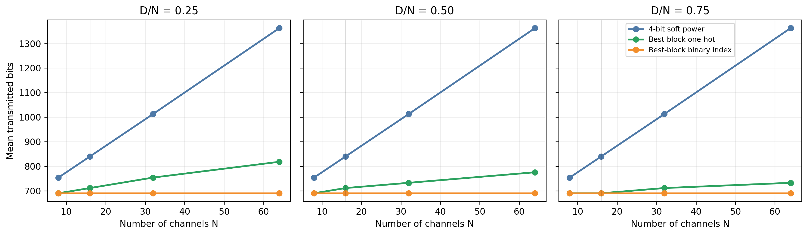
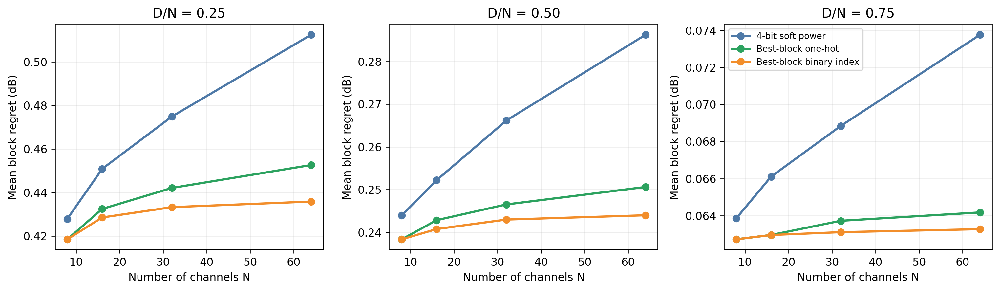
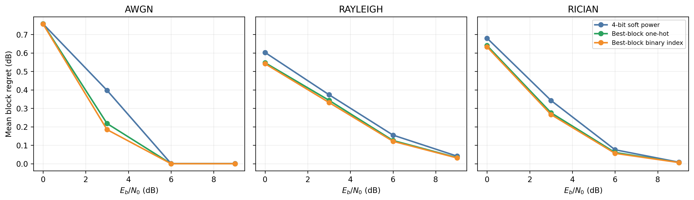

# 阶段4 C1-v4规模可扩展性实验

> 执行日期：2026-07-23  
> 实验性质：Final后的开发集规模扩展，不是新的确认性Final  
> 数据范围：AERPAW 2022年2月11日三个固定站点、180个已经看过的开发扫频  
> 治理状态：未读取C1-v4 Final测量值或指标；不修改已冻结算法和Final结论

## 1. 研究问题

既有C1-v4任务固定为8个信道中选择连续4个信道。此时4-bit软功率需要32个语义载荷bit，当前最优块独热指示需要5 bit；但152 bit固定协议开销压缩了两者在实际数字链路中的差距。为了检验方法是否具有规模可扩展性，本实验回答：

1. 当频谱离散维度N增加时，逐信道软功率和任务充分块指示的应用层及实际发送bit如何增长？
2. 当连续需求比例D/N变化时，当前独热指示是否仍能以更低通信成本保持资源选择性能？
3. 使用⌈log₂(N−D+1)⌉ bit直接编码最优块编号，是否具有进一步压缩潜力？
4. 更短的任务报文能否在信道恶化时通过更高整包成功率减缓regret上升？

## 2. 实验协议

频谱维度取N = {8，16，32，64}，连续需求比例取D/N = {0.25，0.50，0.75}，共12个任务。每个任务使用相同180个真实功率扫频重新划分信道，保持2400—2483.5 MHz总带宽不变。

三种比较方法为：

| 方法 | 有效载荷长度 | 说明 |
|---|---:|---|
| 4-bit软功率 | 4N | 上传每个信道的归一化平均功率 |
| 最优块独热指示 | N−D+1 | 当前C1-v4表示；最优候选位置为0，其余为1 |
| 最优块二进制编号 | ⌈log₂(N−D+1)⌉ | 新的开发方案；直接编码候选块编号 |

三者均增加相同的152 bit协议开销。上报链路覆盖AWGN、Rayleigh和Rician信道，Eᵦ/N₀ = {0，3，6，9} dB，每个条件重复10次，统一使用分包、CRC、Hamming(7,4)、数字调制和有限ARQ。报文完整解码时使用其资源决策；整包失败时统一回退块0。

统计仍按72个“站点×本地小时”时间簇执行10,000次配对bootstrap。预先冻结的描述性强目标为：

> 相对4-bit软功率，实际发送bit至少降低20%，并且平均regret差的单侧95%分组上界不大于0。

该门槛只用于描述规模扩展结果，不构成新的Final假设。

## 3. 编码长度分析

设候选连续块数量M = N−D+1，则三种报文总长度分别为：

> B_soft = 152 + 4N  
> B_onehot = 152 + M  
> B_index = 152 + ⌈log₂M⌉。

软功率和独热指示在N增大时均为线性增长，但独热指示的斜率由候选块数量决定，明显低于每信道4 bit软功率。紧凑编号则只按候选数量的对数增长；在当前任务范围内，其总报文几乎保持在154—158 bit。

需要注意，应用层长度不会连续映射为实际发送bit。CRC、分包和Hamming编码会形成离散长度区间，因此N=8时157 bit独热指示与155 bit二进制编号的实际发送量相同；只有跨过分包/FEC边界后，额外的源码压缩才转化为链路收益。

## 4. 主要结果

以下给出D/N = 0.5的代表性结果：

| 任务 | 方法 | 应用层bit | 实际bit | 平均regret/dB | CVaR₀.₉/dB |
|---|---|---:|---:|---:|---:|
| N=8，D=4 | 4-bit软功率 | 184 | 753.738 | 0.243942 | 0.852146 |
|  | 独热指示 | 157 | 689.781 | 0.238369 | 0.832927 |
|  | 二进制编号 | 155 | 689.781 | 0.238369 | 0.832927 |
| N=16，D=8 | 4-bit软功率 | 216 | 839.900 | 0.252214 | 0.878665 |
|  | 独热指示 | 161 | 711.044 | 0.242848 | 0.848643 |
|  | 二进制编号 | 156 | 689.781 | 0.240770 | 0.839980 |
| N=32，D=16 | 4-bit软功率 | 280 | 1012.771 | 0.266168 | 0.927160 |
|  | 独热指示 | 169 | 732.363 | 0.246529 | 0.862591 |
|  | 二进制编号 | 157 | 689.781 | 0.242987 | 0.847938 |
| N=64，D=32 | 4-bit软功率 | 408 | 1362.809 | 0.286245 | 0.984227 |
|  | 独热指示 | 185 | 775.291 | 0.250619 | 0.873830 |
|  | 二进制编号 | 158 | 689.781 | 0.244000 | 0.848536 |

随着N增加，软功率报文长度和整包失败风险快速增加，而任务指示的增长明显更慢。在D/N = 0.5时：

- N=8：独热指示实际bit降低8.49%；
- N=16：降低15.34%；
- N=32：降低27.69%，首次超过20%强目标；
- N=64：降低43.11%。

紧凑二进制编号在N=32和N=64时分别降低31.89%和49.39%。在全部12个任务中，当前独热指示和二进制编号各有6个任务达到“实际bit降低至少20%且regret非劣”的强目标；这6个任务正是全部N=32与N=64配置。

三个需求比例下，当前独热指示在N=64时的实际bit降幅为：

| D/N | 软功率实际bit | 独热指示实际bit | 降幅 |
|---:|---:|---:|---:|
| 0.25 | 1362.809 | 817.961 | 39.98% |
| 0.50 | 1362.809 | 775.291 | 43.11% |
| 0.75 | 1362.809 | 732.363 | 46.26% |

所有12个任务中，独热指示和二进制编号相对软功率的平均regret差均为负，且单侧95%上界均低于0。例如N=64、D=32时：

- 独热指示平均regret差为−0.035626 dB，单侧95%上界−0.029970；
- 二进制编号平均regret差为−0.042245 dB，单侧95%上界−0.035367。

这并不是因为块编号比软功率包含更多频谱信息，而是因为成功解码时两者均接近最优；更短的任务报文具有更高整包成功率，因而减少了失败后回退块0造成的系统regret。

## 5. 信道恶化结果

以N=64、D=32为代表，在AWGN 3 dB下：

| 方法 | 帧成功率 | 平均regret/dB | 实际bit |
|---|---:|---:|---:|
| 4-bit软功率 | 0.483 | 0.3974 | 1562.7 |
| 独热指示 | 0.727 | 0.2178 | 810.1 |
| 二进制编号 | 0.765 | 0.1847 | 707.4 |

在Rayleigh和Rician信道的中低信噪比区域，任务指示同样保持更低regret。极端AWGN 0 dB时三种报文几乎全部失败，统一回退块0，因而方法差异消失；高信噪比下三种方法均接近零regret。因此，可以支持的结论是：

> 在链路处于整包成功率过渡区时，更短的任务指示报文比软功率具有更慢的性能退化；在所有方法均失败或均成功的极端区间，优势会收敛。

不能写成“任何信道恶化程度下都保持固定优势”。

## 6. 对论文创新点的影响

该实验补足了早期验收建议中的20%通信节省和信道恶化分析。在原N=8任务上，152 bit固定协议开销导致实际bit只降低约8.5%；当任务扩展到N≥32时，当前独热表示在全部测试需求比例上均超过20%实际bit降幅，同时保持平均regret统计非劣。由此可以把创新点进一步表述为：

> 对目标和连续带宽需求预先确定的频谱资源选择任务，最优候选块指示是任务充分语义。其上报长度相对逐信道软功率具有更低的规模增长率，并可通过缩短数字报文在中低信噪比区间同时改善通信成本与任务可靠性。

紧凑二进制编号展示了更强的对数级载荷扩展潜力，但它是在Final之后提出和开发的协议优化，没有经过独立数据确认，不能与已确认的独热C1-v4混写为Final贡献。论文可把它作为“进一步协议压缩”或“可扩展性增强方案”。

## 7. 局限性

1. 频谱总带宽固定，N增加意味着每个离散信道变窄，不等同于扩大物理带宽。
2. 所有任务仍是固定D的单个连续块选择；动态带宽、多用户、不连续载波聚合和二次规划不在实验范围内。
3. 发送端使用当前扫频直接计算最优块，实验研究的是语义表示和数字链路，不是噪声功率预测。
4. 数据来自固定站点和同一采集活动，回传链路仍为仿真。
5. 二进制编号只是开发证据；如进入主算法，必须冻结真实codec并使用新的独立数据验证。

## 8. 可复现文件

- 冻结协议：`configs/stage4_c1_v4_scalability_experiment.json`
- 执行代码：`scripts/run_stage4_c1_v4_scalability_experiment.py`
- 原始结果：`results/stage4/c1_v4_scalability_v1/scalability_result.json`
- 图表代码：`scripts/generate_stage4_c1_v4_scalability_assets.py`
- 图、CSV与哈希清单：`results/stage4/c1_v4_scalability_assets_v1/`
- 治理与公式测试：`tests/test_c1_v4_scalability_experiment.py`
