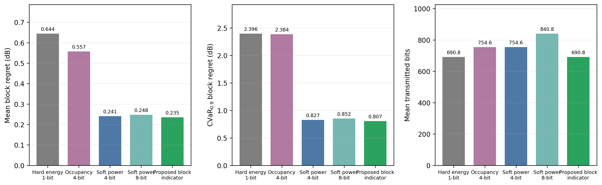
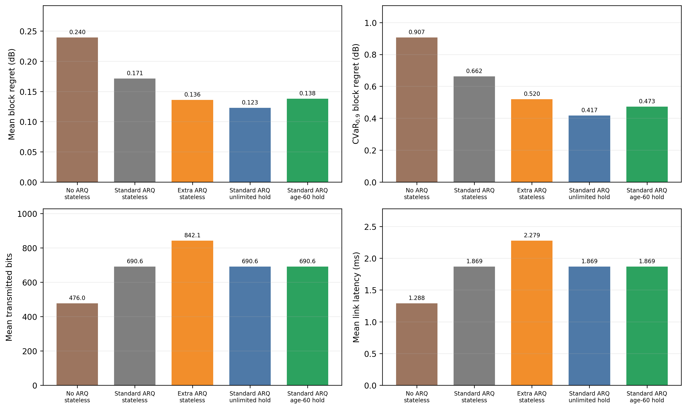

# 阶段4 C1-v4补充基线实验

> 执行日期：2026-07-23  
> 实验性质：Final后的解释性补充实验，不是新的确认性检验  
> 数据边界：仅使用已经看过的AERPAW开发验证缓存；未读取C1-v4 Final测量值或Final指标  
> 结论边界：本实验用于回答“提出的方法为何有效、代价如何”，不改变已完成的单次Final结论

## 1. 研究目的

既有Final已经确认：任务充分的最优块指示优于occupancy表示，60分钟时效保护回退优于无状态回退。为使论文比较体系更完整，本实验补充两类基线：

1. **信息表示基线**：将提出的最优块指示与硬能量判决、occupancy、4-bit软功率和8-bit软功率比较，区分“保留连续功率信息”和“只传递最终任务所需信息”各自带来的收益。
2. **可靠性基线**：将60分钟状态回退与无ARQ、标准ARQ、额外ARQ及无限期历史保持比较，分析重传、接收端状态和陈旧保护之间的性能—开销权衡。

## 2. 公平性与可复现协议

表示实验使用2月11日开发验证集180景，可靠性实验使用2月12日时序开发验证集180景。两组实验均覆盖AWGN、Rayleigh、Rician三种信道和 Eᵦ/N₀ = {0，3，6，9} dB，每个条件重复10次。所有成对方法使用共同随机种子和相同链路噪声轨迹。

统一链路执行分包、CRC、Hamming(7,4)、数字调制和有限ARQ，并报告实际发送bit及链路时延，而不是仅比较应用层报文长度。统计单位为“站点×本地小时”时间簇，共72簇；差异采用10,000次配对分组bootstrap，报告单侧95%上界与单侧p值。

实验前冻结配置及输入哈希。执行程序会拒绝任何路径名含`c1_v4_final`的输入，并在结果中记录：

- `final_measurement_values_loaded = false`
- `final_metrics_loaded = false`
- `changes_final_claim = false`
- `confirmatory = false`

## 3. 补充基线定义

### 3.1 信息表示

| 方法 | 表示内容 | 应用层bit | 作用 |
|---|---|---:|---|
| 硬能量1-bit | 每频道是否超过固定能量阈值 | 160 | 经典硬判决感知基线 |
| occupancy 4-bit | 每频道占用程度的4-bit量化 | 184 | 既有代理语义基线 |
| 软功率4-bit | 每频道归一化连续功率的4-bit量化 | 184 | 经典软判决信息基线 |
| 软功率8-bit | 每频道归一化连续功率的8-bit量化 | 216 | 更高精度软信息基线 |
| 最优块指示1-bit | 五个候选块中的最优块独热指示 | 157 | 本文任务充分语义 |

硬能量阈值冻结为归一化均值0.375，对应3σ判决及8σ裁剪尺度。固定块0和均匀随机选择用作零上报参考；已知真实最优块的oracle仅作为不可实现的零后悔下界。

### 3.2 可靠性机制

| 方法 | 最大重传次数 | 解码失败后的处理 |
|---|---:|---|
| 无ARQ无状态 | 0 | 选择固定块0 |
| 标准ARQ无状态 | 1 | 选择固定块0 |
| 额外ARQ无状态 | 2 | 选择固定块0 |
| 标准ARQ无限保持 | 1 | 无限期复用最近成功块 |
| 标准ARQ 60分钟保护 | 1 | 状态年龄≤60分钟时复用，否则选择块0 |

## 4. 表示基线结果

| 方法 | 平均regret/dB | CVaR₀.₉/dB | 实际发送bit | 帧成功率 |
|---|---:|---:|---:|---:|
| 硬能量1-bit | 0.644452 | 2.396475 | 690.751 | 0.682269 |
| occupancy 4-bit | 0.557435 | 2.384316 | 754.553 | 0.676574 |
| 软功率4-bit | 0.241049 | 0.826542 | 754.553 | 0.676574 |
| 软功率8-bit | 0.247873 | 0.852357 | 840.777 | 0.666667 |
| 最优块指示1-bit | **0.235225** | **0.806517** | **690.751** | **0.682269** |

最优块指示相对硬能量判决将平均regret和CVaR分别降低63.50%和66.35%；两者的实际bit相同。这是因为157 bit与160 bit报文经过分包、CRC和FEC后落入相同编码长度，说明应用层节省不一定线性转化为物理发送bit节省。

相对occupancy，最优块指示将平均regret降低57.80%、CVaR降低66.17%、实际bit降低8.46%。相对4-bit软功率，平均regret仅进一步降低2.42%、CVaR降低2.42%，但实际bit降低8.46%。相对8-bit软功率，三者分别改善5.10%、5.38%和17.84%。

在72个时间簇的配对bootstrap中，最优块指示相对四种基线的平均regret及CVaR差异的单侧95%上界均低于0。相对4-bit软功率的效应很小但方向稳定：平均regret差为−0.005824 dB，上界−0.004287；CVaR差为−0.020025 dB，上界−0.011015。

该结果说明，主要性能跃升来自保留连续功率排序信息，而本文表示相对软功率的进一步贡献主要是**任务充分压缩**：只发送完成固定连续块选择所需的离散决策，以较小报文保留相同甚至略优的任务性能。8-bit表示没有优于4-bit，是因为其量化精度收益不足以抵消更长报文造成的整包失败概率增加。

零上报参考中，固定块0和均匀随机选择的平均regret分别为0.740120和0.607742 dB；oracle为0，但oracle假定融合端免费知道真实最优块，不能作为可部署方法。

## 5. 可靠性基线结果

| 方法 | 平均regret/dB | CVaR₀.₉/dB | 实际发送bit | 时延/ms |
|---|---:|---:|---:|---:|
| 无ARQ无状态 | 0.239531 | 0.906824 | 476.000 | 1.288 |
| 标准ARQ无状态 | 0.171237 | 0.662148 | 690.575 | 1.869 |
| 额外ARQ无状态 | 0.136026 | 0.519891 | 842.123 | 2.279 |
| 标准ARQ无限保持 | **0.122709** | **0.417162** | 690.575 | 1.869 |
| 标准ARQ 60分钟保护 | 0.137960 | 0.472561 | 690.575 | 1.869 |

与标准ARQ无状态相比，60分钟保护将平均regret降低19.43%、CVaR降低28.63%，且实际bit、时延和帧成功轨迹完全相同。配对差分别为−0.033277 dB和−0.189587 dB，单侧95%上界分别为−0.020194和−0.134809，说明收益来自接收端状态而非额外通信。

与额外ARQ相比，60分钟保护的平均regret高1.42%，该差异没有统计优势（单侧p = 0.649）；但CVaR低9.10%，实际bit和时延均低约18.00%。因此，在当前开发集上，接收端状态以较低通信成本获得了与额外重传近似的平均性能，并改善了尾部风险。

必须保留的负结果是：无限保持在该数据上优于60分钟保护。60分钟保护的平均regret和CVaR分别高12.43%和13.28%，且配对差方向明确。这并不证明年龄保护无效，而是说明本开发集由固定站点、缓慢变化扫频构成，没有充分覆盖年龄上限要防范的移动、突变干扰和长时间失联。无限保持可利用更老历史，因此在这种平稳数据上占优；但它允许无限复用陈旧状态，不具备可声明的失效安全边界。60分钟上限应被解释为面向未观测分布变化的保守约束，而不是当前固定站点数据上的纯性能最优参数。

## 6. 对论文创新性的影响

补充基线使两个核心贡献的定位更清楚：

1. **任务充分块语义不是简单替代occupancy。** 它相对硬判决和occupancy获得大幅任务收益；相对保留连续功率的软判决，主要优势转为低bit任务充分压缩，避免宣称不合理的大幅算法优势。
2. **零比特状态回退不是提高物理层解码率。** 它在相同包成功轨迹下利用最近成功决策，优于无状态回退，并以明显低于额外ARQ的成本改善尾部风险。
3. **60分钟年龄上限是安全性约束，不是现有数据上的经验最优值。** 当前数据支持“状态有用”，但不能单独证明“60分钟优于任何更长保持时间”。其最终正结论仍以已经完成的预注册Final中“优于无状态回退”为准。

## 7. 结论与后续边界

补充基线完成了论文所需的经典硬/软表示、零通信参考、ARQ及状态保持比较。结果支持任务充分语义的低bit优势和接收端状态的可靠性收益，同时揭示年龄保护在平稳固定站点数据上的保守性能代价。

后续若要验证时效保护本身，应新增移动节点、突发干扰或人为长失联实验，比较多个预先冻结的年龄阈值，并将“陈旧误用率”纳入指标。该工作属于新的外部效度研究，不能重跑或覆盖已经消费的C1-v4 Final。

## 8. 可复现文件

- 冻结协议：`configs/stage4_c1_v4_supplementary_baselines.json`
- 执行脚本：`scripts/run_stage4_c1_v4_supplementary_baselines.py`
- 原始结果：`results/stage4/c1_v4_supplementary_baselines_v1/supplementary_baselines_result.json`
- 图表脚本：`scripts/generate_stage4_c1_v4_supplementary_baseline_assets.py`
- CSV、图和哈希清单：`results/stage4/c1_v4_supplementary_baseline_assets_v1/`
- 治理与定义测试：`tests/test_c1_v4_supplementary_baselines.py`
