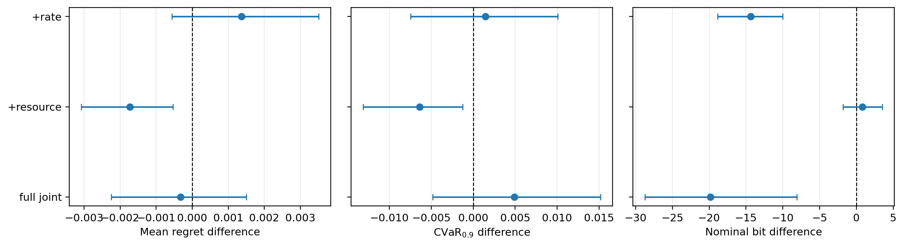
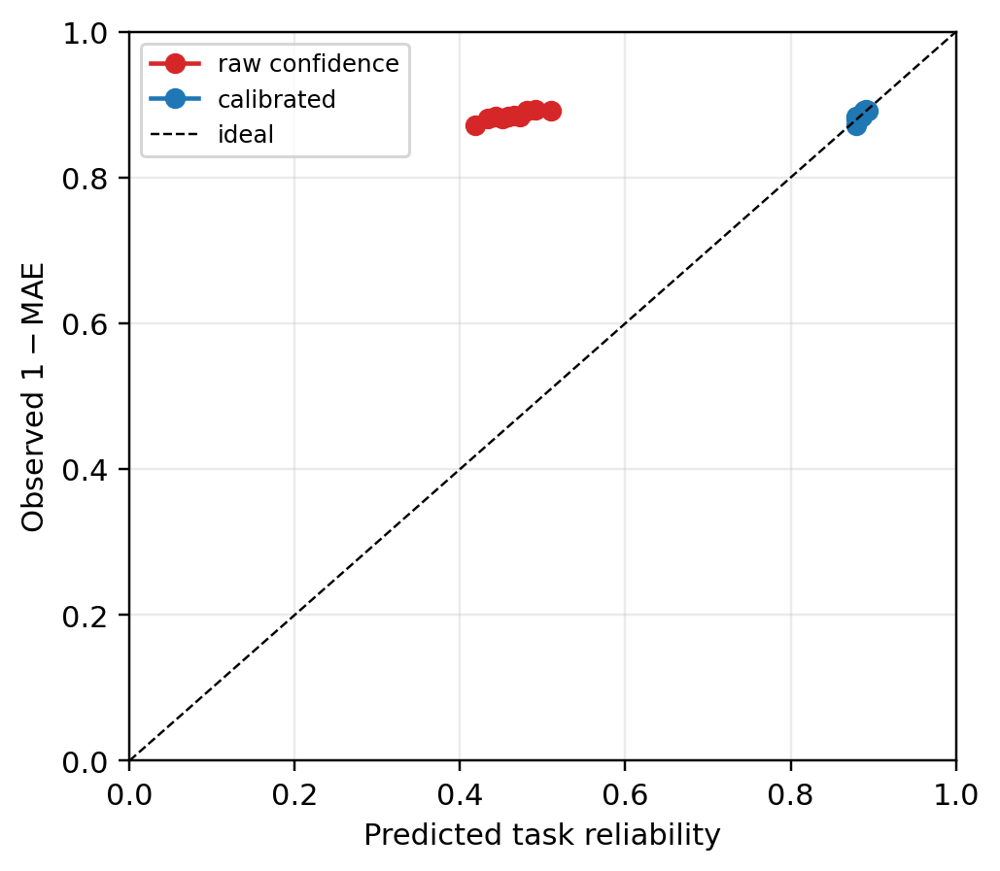

# 面向频谱资源选择的任务导向数字语义通信：阶段四方法与实验研究

> 历史状态：本文主体记录Final前开发研究。阶段4正式结论已更新至`docs/STAGE4_THESIS_CHAPTER_FINAL.md`和`docs/STAGE4_C1_V4_FINAL_RESULTS.md`；其中C1-v4两级Final与原Final选择性G2均已通过。

> 文档性质：硕士论文式阶段研究报告。  
> 证据状态：本文全部性能数字来自冻结的train、calibration和validation开发流程；独立final holdout尚未访问，因此所有正性能结论均须带有“开发集”限定。

## 摘要

多无人机协同宽带频谱感知通常需要将各节点观测上传至中心节点，再据此选择可用频谱。若直接上传原始I/Q或完整谱图，通信成本较高；若只上传硬判决，又可能丢失影响资源选择的关键信息。为此，本阶段研究一种面向下游频谱资源选择的任务导向数字语义通信框架：无人机不追求在接收端重建原始信号，而是传输占用概率、质量信息和必要的局部证据；中心节点在真实数字链路解码后完成融合，并从8个资源块中选择连续4块作为可用资源。

研究围绕三条路线展开。第一，设计资源选择后悔值感知的语义生成损失C1，使模型直接关注“错误是否会导致选错频谱”。第二，研究基于反事实边际价值和单位bit收益的节点—语义粒度调度C2。第三，研究面向错误多数、陈旧报告和节点失效的可靠少数保护与任务触发补传C3。实验表明，C1是唯一通过预注册开发门槛的算法候选：相对检测损失基线，平均资源后悔值差为−0.001729，95%置信区间为[−0.003082, −0.000534]；尾部CVaR差为−0.006419，区间为[−0.013153, −0.001264]；名义bit差区间包含0。C2虽具有明显的oracle改进空间，但当前价值网络排序接近随机，未通过Gate B。C3能够修正特定故障，却因误触发、额外bit和尾部风险未同时达标而未通过Gate C。端到端数字链路实验进一步表明，选择性G2相对全节点G2在12个信道点均节省实际发送bit，但其资源后悔非劣性仍需独立final数据确认。

本阶段的主要价值不在于堆叠多个神经网络，而在于建立了“频谱任务损失—变长数字语义—真实链路成本—解码后资源决策—scene级统计”的闭环，并完整保留未通过门槛的机制及原因。当前开发工程和统计协议已经冻结，最终结论仍等待至少200个新增独立真实scene的一次性检验。

**关键词：** 多无人机；宽带频谱感知；任务导向语义通信；频谱资源选择；变长数字语义；资源后悔值；可靠性

## 1. 引言

宽带频谱感知的最终目的通常不是生成一张视觉上完整的频谱图，而是支持动态频谱接入：从候选频段中找到干扰较低、连续带宽足够的资源。多无人机系统能够从不同位置观测无线环境，但也带来明显的上行通信压力。原始I/Q数据量最大，完整时频图仍然较大，逐频点硬判决虽然紧凑，却难以表达置信度、前端质量和局部冲突。

传统感知模型常以逐频点分类准确率、F1或均方误差为目标。这些指标不能充分反映下游决策：两个模型即使具有相似检测误差，其中一个错误可能出现在不会被选择的高占用频段，另一个错误却可能把受干扰频段误认为最佳资源。后者对系统造成的实际损失更大。因此，本研究把“是否选错连续频谱块”引入语义生成和系统评价。

本文讨论的“语义”不是自然语言或图像内容，而是与频谱资源选择任务直接相关的数字信息，包括占用概率、质量元数据和局部频谱证据。图像语义、ROI和视觉JSCC不是本阶段核心；系统也没有MIMO信道矩阵、联合预编码或空口模拟叠加，因而应称为多节点数字上报系统，而不是MIMO或AirComp系统。

## 2. 问题定义与系统闭环

### 2.1 面向非专业读者的直观解释

可以把8个频谱资源块理解为一排8条候选车道，系统需要连续选择4条最空闲的车道。每架无人机看到的“拥堵程度”不同，而且只能通过有限带宽向中心报告。研究问题不是如何把无人机看到的全部画面无损传回，而是：应发送哪些信息，才能让中心以尽可能少的bit选对4条车道。

系统闭环为：

```text
本地宽带观测
    ↓
冻结频谱检测器与C1语义生成头
    ↓
G0/G1/G2/G3变长数字语义消息
    ↓
分包 + CRC + FEC + 调制 + 信道 + ARQ
    ↓
中心节点解码、质量审计与多节点融合
    ↓
选择连续4个资源块
    ↓
计算资源后悔、clean rate、CVaR、bit与时延
```

### 2.2 资源选择任务

设系统包含$K=8$个频谱资源块，融合后的占用估计为

$$
\hat{\mathbf o}=[\hat o_1,\ldots,\hat o_K]^\mathsf T.
$$

系统需要选择长度为$D=4$的连续资源块，其起始位置为

$$
\hat a=\arg\min_{a\in\{1,\ldots,K-D+1\}}
\frac{1}{D}\sum_{k=a}^{a+D-1}\hat o_k.
$$

若真实占用为$\mathbf o$，则资源选择后悔值定义为

$$
\mathcal R_{\mathrm{occ}}
=\frac{1}{D}\sum_{k=\hat a}^{\hat a+D-1}o_k
-\min_a\frac{1}{D}\sum_{k=a}^{a+D-1}o_k.
$$

该值表示“实际选择资源的真实平均占用”与“oracle最优资源的真实平均占用”之间的差距。数值为0表示选中了最优连续频谱块，数值越大表示选频决策越差。

### 2.3 评价指标

本阶段同时报告以下指标：

- `occupancy regret`：选频决策相对oracle的损失，是主要任务指标；
- `CVaR0.9`：最差10%场景中的平均风险，用于评价尾部可靠性；
- `clean resource rate`：所选资源满足低占用条件的比例；
- `missed occupancy`与`false occupancy`：漏占用和虚假占用；
- `Brier`与ECE：占用概率和质量概率的校准程度；
- 实际发送bit：包含消息头、CRC、FEC、调制填充、反馈和重传；
- 端到端时延与report delivery ratio。

需要特别说明：delivery ratio只说明包是否送达，不能替代解码后的资源后悔值、clean rate和Brier。因此，本文所有端到端任务结果均在实际解码路径之后计算。

## 3. 多粒度数字频谱语义

系统设计G0—G3四种数字语义粒度：

| 粒度 | 发送内容 | 主要用途 |
|---|---|---|
| G0 | 不发送 | 当前报告无正边际价值或预算不足 |
| G1 | 每资源块1-bit粗占用预览 | 低成本建立融合初始状态 |
| G2 | 4-bit量化占用概率及质量元数据 | 常规高质量任务报告 |
| G3 | 8-bit占用、质量和局部证据 | 冲突确认或高风险补传 |

每个消息均具有版本、scene、节点、粒度、位宽和完整性字段。质量元数据覆盖感知SNR、预测置信度、归一化熵、削顶、带外泄漏、噪声底稳定性、峰背比、信息年龄、上报成功概率和校准误差。只有实际发送或接收端可获得的信息才能进入调度器，未发送字段不能被算法“免费读取”。

数字链路统一采用应用层编码、分包、CRC、FEC、调制、AWGN/Rayleigh/Rician信道和截断ARQ。不同表示在相同保护规则下比较，避免只计算语义payload而忽略协议开销。

## 4. 三条算法研究路线

### 4.1 C1：资源后悔感知语义生成

C1的核心思想是：模型训练不仅要预测占用，还要关心预测错误是否改变最终的连续频谱块选择。由于离散`argmin`不可直接反向传播，训练阶段使用softmin构造可微资源分布和soft regret；推理与报告仍使用真实离散选择。

统一损失可概括为

$$
\mathcal L
=\lambda_{\mathrm{det}}\mathcal L_{\mathrm{det}}
+\lambda_{\mathrm{resource}}\widetilde{\mathcal R}_{\mathrm{occ}}
+\lambda_{\mathrm{rate}}\mathcal C_{\mathrm{bit}}
+\lambda_{\mathrm{risk}}\mathcal L_{\mathrm{risk}}
+\lambda_{\mathrm{cal}}\mathcal L_{\mathrm{cal}}.
$$

为避免把多项同时变化造成的随机收益误认为创新，Gate A只比较四种冻结设置：

1. `detection-only`：仅检测损失；
2. `detection+rate`：检测与码率；
3. `detection+resource`：检测与资源后悔；
4. `full-joint`：检测、码率、资源和其他联合项。

四种方法使用相同冻结输入、初始化规则、训练轮数、5个预注册seed和相同名义预算。

### 4.2 C2：反事实价值与单位bit调度

在当前已收到报告集合$S$下，候选动作$j=(n,g)$表示让节点$n$发送粒度$g$。其反事实边际价值定义为

$$
\Delta U_j(S)=\mathcal R(S)-\mathcal R(S\cup\{j\}),
\qquad
V_j(S)=\frac{\Delta U_j(S)}{\mathbb E[B_j]}.
$$

$\Delta U_j$表示新增报告能减少多少资源后悔，$V_j$表示每个期望发送bit带来的任务收益。训练标签只在train真值上生成；部署输入仅包含当前融合信念、候选节点现有低粒度报告、可用质量、粒度状态和期望bit，不允许读取真实占用或候选高精度报告。

本阶段实现并比较了五seed价值网络、解析歧义—分歧—质量评分、单调PAV校准、贪心调度和精确多选择背包。研究重点不仅是求解背包问题，也包括低开销G1预览是否包含足够信息来区分节点价值。

### 4.3 C3：可靠少数与任务触发补传

普通平均或多数融合可能在多数节点同时陈旧、偏移或高置信错误时失败。C3为每个报告构造可审计质量分数，并尝试两种机制：

- 可靠少数保护：当少数报告质量明显更高且与多数冲突时，限制多数错误传播；
- 冲突触发G3：中心检测到关键资源块冲突后，请求高精度局部证据补传。

实验覆盖正常、错误清空多数、频移多数、高置信错误多数、陈旧多数、关键节点失效和良性单点误报七类场景。该实验用于机制诊断，并不等同于真实多无人机空间协同证据。

## 5. 实验设置

### 5.1 数据与统计单位

开发阶段使用冻结的RadDet来源和受控同scene多节点扰动构造train、calibration和validation。一个scene的所有节点视图、信道重复、重传轨迹和语义粒度均保持在同一split内。链路重复不能作为新的独立样本，所有统计均以scene为单位。

Gate A包含5个训练seed和150个配对validation scene，采用10,000次层次配对bootstrap。端到端链路实验覆盖150个scene、3类信道、4个$E_b/N_0$点和每scene 5次嵌套链路重复，即每种方法9,000个链路实例，三种上报方法合计27,000个实例。

### 5.2 比较方法

- C1：detection-only、detection+rate、detection+resource、full-joint；
- 上报策略：all-G1、G1+阶段3固定先验单节点G2、all-G2；
- 融合策略：mean、median、SNR加权、阶段3鲁棒质量、审计质量均值、可靠少数、冲突触发G3。

### 5.3 统计判决

开发阶段根据预注册Gate A/B/C决定分支是否继续，不选择最佳seed、不删除困难scene。正式final已冻结为两个主检验族：C1与选择性G2。置信区间使用10,000次scene配对bootstrap，component p值使用单侧配对随机化检验，族内采用intersection-union规则，两族间使用Holm校正。

## 6. 实验结果

### 6.1 C1通过开发集Gate A

表1给出相对detection-only的配对效应。负regret差表示优于基线。

| 方法 | regret差及95% CI | CVaR差及95% CI | 名义bit差及95% CI |
|---|---:|---:|---:|
| detection+rate | 0.001363 [−0.000566, 0.003513] | 0.004907 [−0.004821, 0.015191] | −19.86 [−28.75, −8.10] |
| detection+resource | **−0.001729 [−0.003082, −0.000534]** | **−0.006419 [−0.013153, −0.001264]** | 0.78 [−1.83, 3.53] |
| full-joint | −0.000326 [−0.002251, 0.001505] | 0.001442 [−0.007452, 0.010088] | −14.35 [−18.84, −10.01] |

`detection+resource`的平均与尾部regret区间均完全低于0，而bit区间包含0，因此在近似相同通信成本下通过Gate A。`detection+rate`虽然减少bit，却使regret方向变差；`full-joint`没有形成稳定收益。由此可见，简单加入更多损失项并不必然优于直接对齐下游资源任务。



### 6.2 C2具有oracle空间，但价值排序失败

C2实验发现，若能知道每个候选高精度报告的真实反事实价值，一步oracle平均可减少0.022672的regret；当前学习选择只减少0.003097，说明问题具有改进空间，但现有可部署特征未能充分识别这一空间。

| 诊断指标 | 结果 |
|---|---:|
| value/expected-bit MAE | $2.5264\times10^{-5}$ |
| pooled Spearman | 0.00938 |
| top-1/top-2/top-3 oracle召回 | 0.1200/0.2133/0.3000 |
| 当前选择regret reduction | 0.003097 |
| oracle regret reduction | 0.022672 |

低MAE并没有转化为有效排序，因为目标值本身接近0且分布高度压缩。1-bit G1使四节点预览几乎同质；2-bit G1额外增加约75.15 bit，却没有稳定改善regret，并恶化Brier及后续升级空间；113-bit稀疏残差草图虽然恢复节点差异，但其固定开销抵消系统级收益。五seed价值网络在普通预览和草图预览下均未稳定超过简单先验，因此Gate B失败。


这一负结果说明，调度算法的瓶颈不一定是网络容量或背包求解器，也可能是“低成本预览不足以观察节点的条件任务价值”。

### 6.3 C3未通过可靠性门槛

| 方法 | pooled regret | CVaR | clean rate | 触发率 | 额外bit |
|---|---:|---:|---:|---:|---:|
| mean | 0.026518 | 0.133073 | 0.4867 | 0 | 0 |
| SNR加权 | 0.025741 | 0.132340 | 0.5000 | 0 | 0 |
| 审计质量均值 | 0.025537 | 0.134315 | 0.5133 | 0 | 0 |
| 可靠少数 | 0.025537 | 0.134315 | 0.5133 | 0.1438 | 0 |
| 冲突触发G3 | 0.025304 | 0.135580 | 0.5133 | 0.4648 | 390.66 |

可靠少数的实际保护率为0，结果退化为审计质量均值；冲突触发G3对特定频移故障有修正作用，却产生46.48%的总体触发率和390.66 bit额外成本，并使pooled CVaR高于简单mean。良性单点误报场景还出现100%误触发。由于收益、误触发、bit和尾部风险没有同时达标，Gate C失败，最终系统回退为固定经典融合。

### 6.4 选择性G2节省实际发送bit

端到端实验比较all-G1、选择性G2和all-G2。选择性G2只让阶段3冻结先验选中的单节点升级，其他节点保持G1。在AWGN、Rayleigh、Rician和0/3/6/9 dB共12个信道点上，选择性G2相对all-G2每scene节省212.2—666.2 bit，平均节省425.2 bit。

与此同时，12个点的regret差置信区间均跨0，部分上界超过预注册final非劣界0.0026813。因此，开发结果支持“选择性G2节省实际发送bit”，但尚不能声称它已经在独立数据上满足任务非劣性。


### 6.5 质量校准和异常敏感性

原始质量置信度的Brier/ECE分别为0.179472/0.422625，经calibration上的单调PAV映射后，validation聚合值降至0.000421/0.002756。七类受控异常的成对检测率均为1.0，质量分数AUC为0.6614—1.0000。



该结果证明质量特征能够响应注入故障，并不代表真实故障发生率、真实异常检测准确率或空间协同收益已经得到证明。

### 6.6 复杂度

| 组件 | 参数量 | 线性MAC | CPU中位时延 | CPU p95时延 |
|---|---:|---:|---:|---:|
| C1 head/scene | 1,740 | 1,664 | 0.4238 ms | 0.7075 ms |
| C2/8候选/单seed | 5,697 | 44,800 | 0.0695 ms | 0.1201 ms |
| C2/8候选/五seed | 28,485 | 224,000 | 0.3502 ms | 0.5706 ms |

C1新增head较轻量，但这些时延仅为本机单线程CPU测量，不包括冻结检测器、codec、链路仿真和射频前端，也不能替代无人机板端实测。C2虽然计算量不大，仍因Gate B失败而不进入最终候选。

## 7. 结果讨论

### 7.1 得到支持的结论

1. 在开发validation上，直接优化资源选择后悔比只优化检测更能改善连续频谱块选择，且没有观察到稳定bit增加。
2. 完整数字链路成本必须计入协议开销和重传；只比较payload长度会高估语义压缩收益。
3. 选择性提高少数节点报告粒度能够稳定节省实际发送bit，但其任务非劣性仍需final确认。
4. scene级统计、CVaR和失败场景能够揭示平均指标未展示的风险。

### 7.2 未得到支持的结论

1. 当前反事实价值网络不能可靠预测最有价值的升级节点。
2. 当前可靠少数和冲突触发补传不能同时满足收益、误触发、bit和CVaR要求。
3. 受控多节点扰动不能证明真实多无人机空间协同H3。
4. 本系统没有MIMO物理层、联合预编码或AirComp，不能称为MIMO语义通信算法。
5. 当前没有真实raw-I/Q压缩对照，IQ bit数只可作为容量参考，不能写成实测codec结果。

### 7.3 阶段创新与研究价值

本阶段最有证据支持的创新是：

- 将连续频谱块occupancy regret直接引入变长频谱语义生成，而不是仅优化逐频点检测；
- 建立统一计入header、CRC、FEC、填充、重传和反馈的公平数字语义链路；
- 以当前融合状态为条件定义报告的反事实价值/bit，并通过负结果揭示预览可观测性与通信开销之间的边界；
- 将平均性能、CVaR、受控失效和预注册门控结合，避免只报告有利平均结果。

其中第一项是当前唯一通过算法性能门槛的核心候选；第二和第四项属于实验与评价方法贡献；第三项目前是方法定义和负结果贡献，不能表述成已验证的性能提升。

## 8. 与相关工作的区别

协作频谱感知语义通信已有工作研究分布式语义表示与AirComp，任务导向ARQ研究根据推理结果决定是否重传，多智能体视觉协同研究消息和协作者选择，MIMO任务语义通信则显式联合信道矩阵、预编码和语义编码。本研究与它们共享“只传任务相关信息”的思想，但研究对象和证据口径不同：本文关注可审计数字包、连续频谱块选择后悔和解码后任务指标，不研究模拟空口叠加、图像重建或联合MIMO预编码。逐篇比较见[阶段4相关工作核验矩阵](STAGE4_RELATED_WORK_MATRIX.md)。

## 9. 局限性与final计划

现有开发数据主要来自已冻结RadDet来源和受控同scene多节点视图，不能代替新的真实独立终测。LoRaIQ只有两个独立事件且资源任务饱和，也不足以支持正式H3。当前工程验收为15项通过、1项证据边界豁免、2项外部数据阻塞、0项失败；149项自动测试通过，final访问计数为0。

正式final要求至少200个与开发来源无重叠的独立真实scene，具有scene、采集事件、接收节点、源文件哈希和标签来源。算法、权重、预算、指标和统计规则冻结后，只运行一次C1和选择性G2主检验。若使用公开AERPAW、NIST或ElectroSense数据，必须先以永久排除的pilot完成输入适配和标签规则冻结，再注册未查看模型输出的final部分。

## 10. 结论

本阶段完成了从频谱感知输出到资源选择决策的任务导向数字语义通信闭环。研究表明，直接面向资源决策设计语义损失比单纯追求检测精度更有潜力；同时，节点价值调度和可靠补传并不会因为引入神经网络或更多质量字段而自然成功，其收益受制于低开销预览可观测性、固定协议成本和误触发风险。

因此，阶段四的严谨结论不是“三个创新模块均取得提升”，而是：C1获得开发集统计支持；C2、C3经过完整实现和预注册门控后被淘汰；选择性G2建立了明确的bit优势但仍等待任务非劣final确认。这一结构既保留正结果，也呈现失败机制和证据边界，能够形成逻辑完整、可复现且不过度声明的硕士论文研究章节。

## 参考文献

[1] P. Yi, Y. Cao, X. Kang, Y.-C. Liang, “Integrated Distributed Semantic Communication and Over-the-Air Computation for Cooperative Spectrum Sensing,” *IEEE Transactions on Communications*, 73(4):2416–2430, 2025.

[2] X. Li, S. Bi, S. Wang, X. Li, Y.-J. A. Zhang, “Digital Semantic Device-Edge Co-Inference With Task-Oriented ARQ,” *IEEE Transactions on Vehicular Technology*, 73(9):13986–13990, 2024.

[3] Y. Hu et al., “Pragmatic Communication in Multi-Agent Collaborative Perception,” arXiv:2401.12694, 2024.

[4] C. Cai, X. Yuan, Y.-J. A. Zhang, “End-to-End Learning for Task-Oriented Semantic Communications Over MIMO Channels: An Information-Theoretic Framework,” *IEEE Journal on Selected Areas in Communications*, 43(4):1292–1307, 2025.

[5] B. Liu et al., “mmCooper: A Multi-agent Multi-stage Communication-efficient and Collaboration-robust Cooperative Perception Framework,” *ICCV*, 2025.

[6] W. Chen et al., “Entropy-and-Channel-Aware Adaptive-Rate Semantic Communication with MLLM-Aided Feature Compensation,” arXiv:2501.15414v4, 2026.

[7] B. Li et al., “Toward Reliable Semantic Communication: Beyond Average Performance,” arXiv:2606.01284, 2026.
