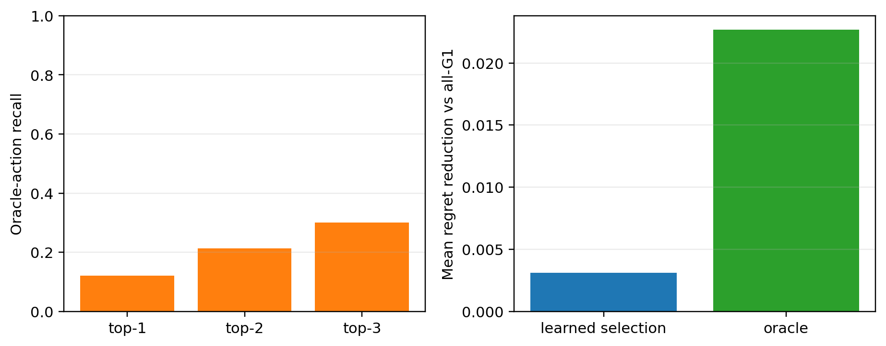
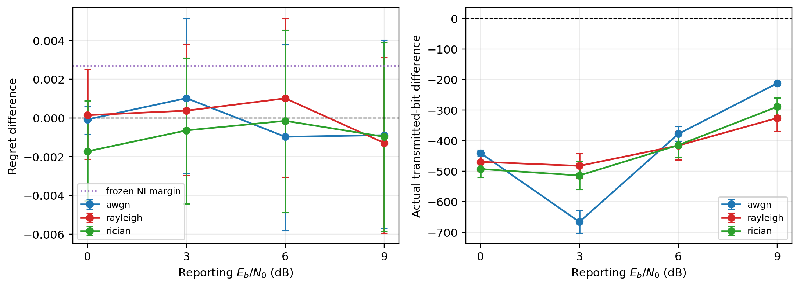

# 硕士论文章节草稿：面向频谱资源选择的后悔感知变长语义通信

> 历史状态：本文件是Final前开发稿，保留用于追溯，不再作为当前论文结论来源。正式终稿见`docs/STAGE4_THESIS_CHAPTER_FINAL.md`，Final声明见`docs/STAGE4_CLAIM_MATRIX.md`。

> 文档状态：development 证据版，供论文方法章与实验章直接改写。  
> 数据边界：仅使用 train、calibration、validation 及阶段2—3已冻结组件；final holdout访问次数为0。  
> 核心表述规则：本文档中的“改善”“显著”均必须带有明确的开发集限定；`[[FINAL_PENDING]]`不得在final运行前删除。

## 1. 研究问题与章节定位

多无人机宽带频谱感知的通信目标并不是在接收端重建完整I/Q或谱图，而是在有限上行资源下，为中心节点提供足以选择低占用连续频谱块的任务信息。传统检测损失主要约束逐通道占用误差，无法区分“不会改变资源选择的误差”和“导致错误选频的关键误差”；只按SNR、置信度或固定节点数上报，也无法显式计算一份报告对当前融合状态的边际任务价值。基于此，本章研究三个问题：

1. 直接优化资源选择后悔值，能否在近似相同语义bit下优于仅优化检测的语义生成器；
2. 节点报告的反事实边际价值能否由可部署特征预测，并据此选择节点与语义粒度；
3. 当前端异常、陈旧、错误多数和节点失效出现时，质量诊断和任务触发补传能否改善尾部风险。

阶段4最初将上述机制统称为RAVES。开发结果表明，只有C1资源后悔感知语义生成通过Gate A；C2调度和C3可靠少数未通过各自门槛。因此论文最终不应把不存在的“完整RAVES”包装成已验证方法，而应采用“一个保留候选、两个经严格门控淘汰的机制研究”结构。

### 1.1 相关工作与本文定位

现有任务语义通信分别研究了协作频谱检测、任务导向ARQ、多智能体视觉消息选择、MIMO任务传输和内容—信道自适应码率。最接近的协作频谱工作将分布式语义通信与AirComp结合，以主用户检测为目标降低上报资源占用；本文不研究模拟空口叠加，而是在可审计数字链路上直接优化连续频谱块选择后悔值。任务导向ARQ提示“CRC成功”不等于任务信息充分，因此本文将反馈、补传bit和等待时延统一计入闭环成本。

视觉协同感知中的消息/协作者选择与多阶段鲁棒融合可作为C2、C3的概念对照，但其图像特征、检测任务和空间协同数据不能替代本文证据。显式联合信道矩阵与预编码的工作才属于MIMO任务语义通信；本文没有联合预编码或MIMO信道矩阵，应称多节点数字上报系统。本文的可检验差异集中在任务后悔损失、实际数字包成本以及scene级平均与尾部统计，而不是通用图像重建或更大的语义网络。逐篇边界和BibTeX记录见[相关工作核验矩阵](STAGE4_RELATED_WORK_MATRIX.md)及[核验参考文献库](references/stage4_verified_refs.bib)。

## 2. 系统模型与任务指标

设第$n$个节点对$K$个频谱资源块输出占用概率

$$
\mathbf p_n=[p_{n,1},\ldots,p_{n,K}]^\mathsf T,\qquad p_{n,k}\in[0,1].
$$

中心节点根据成功接收的语义报告得到融合占用估计$\hat{\mathbf o}$。业务需要选择长度为$D$的连续资源块，其决策为

$$
\hat a=\arg\min_{a\in\{1,\ldots,K-D+1\}}
\frac{1}{D}\sum_{k=a}^{a+D-1}\hat o_k.
$$

若真实占用向量为$\mathbf o$，则离散资源选择后悔值定义为

$$
\mathcal R_{\mathrm{occ}}
=\frac{1}{D}\sum_{k=\hat a}^{\hat a+D-1}o_k
-\min_a\frac{1}{D}\sum_{k=a}^{a+D-1}o_k.
$$

该指标等于实际选择资源的真实平均占用与oracle最优资源之间的差，直接对应选频任务。实验同时报告clean resource rate、missed occupancy、Brier、$\mathrm{CVaR}_{0.9}$、实际发送bit和端到端时延。链路bit包含应用载荷、协议头、CRC、FEC、调制填充和重传；不得使用理想压缩率代替实际数字链路成本。

链路重复嵌套在scene内，不能作为独立样本。统计比较以scene为单位做配对或层次bootstrap；五个训练seed先在scene内聚合，不选择最优seed。

## 3. 多粒度数字频谱语义

系统定义G0—G3四种数字语义粒度：

| 粒度 | 内容 | 作用 |
|---|---|---|
| G0 | 不发送 | 预算不足或边际价值非正 |
| G1 | 1-bit/通道粗占用预览 | 低成本建立当前融合信念 |
| G2 | 量化占用概率与质量元数据 | 常规任务报告 |
| G3 | 更高精度占用、质量与局部证据 | 冲突确认或高风险补传 |

每个消息包含版本、scene/node标识、粒度、概率位宽及完整性字段。G2/G3的质量向量包括感知SNR、预测置信度、归一化熵、削顶率、带外泄漏比、噪声底稳定度、峰背比、信息年龄、上报成功概率和校准误差。质量字段必须通过数字包发送或由接收端CSI获得；未发送字段不能在调度端免费使用。

在calibration上，使用单调PAV映射将原始置信度校准到任务可靠度$1-\mathrm{MAE}(\mathbf p_n,\mathbf o)$，validation只输出聚合结果。原始Brier/ECE分别为0.179472/0.422625，校准后为0.000421/0.002756。该结果说明原始置信度与任务可靠度不在同一尺度，并不代表真实故障检出率已被证明。可靠性图见[图3](../results/stage4/paper_assets_v1/figure_quality_reliability.png)。

## 4. C1：资源后悔感知语义生成

### 4.1 可微任务损失

训练阶段用softmin近似离散连续频谱块选择，得到soft resource regret；推理和报告指标仍使用真实离散argmin。统一目标接口包含检测、码率、资源后悔、漏占用、尾部风险和校准项，但Gate A按一次主要变化原则比较四个固定设置：

- detection-only；
- detection+rate；
- detection+resource；
- full-joint。

四种方法使用相同冻结detector输入、相同初始化、epoch顺序、五个seed、160轮训练和512-bit名义预算。该设计避免把额外训练随机性误当作损失函数收益。

### 4.2 Gate A结果

相对detection-only，detection+resource的validation配对平均regret差为$-0.001729$，95% CI为$[-0.003082,-0.000534]$；$\mathrm{CVaR}_{0.9}$差为$-0.006419$，CI为$[-0.013153,-0.001264]$；名义bit差为$0.78$，CI为$[-1.83,3.53]$。因此其平均和尾部regret置信区间均低于0，而bit区间包含0，满足预注册Gate A。

detection+rate虽然减少约19.86 bit，但regret方向变差；当前full-joint没有稳定regret收益且校准变差。该结果支持保留单独resource项，并停止在同一validation上继续搜索rate、CVaR或联合权重。三种对照的效应与区间见[图1](../results/stage4/paper_assets_v1/figure_gate_a_forest.png)。

必须强调：上述结论仅是候选选择证据。正式H2表述仍为`[[FINAL_PENDING_C1]]`。

## 5. C2：反事实边际价值与调度负结果

### 5.1 反事实价值定义

对当前报告集合$S$和候选动作$j=(n,g)$，定义边际任务价值

$$
\Delta U_j(S)=\mathcal R(S)-\mathcal R(S\cup\{j\}),
\qquad
V_j(S)=\frac{\Delta U_j(S)}{\mathbb E[B_j]}.
$$

训练标签只在train真值上枚举。预测器输入仅包含当前融合信念、候选节点当前G1报告、可用质量字段、当前粒度状态、目标粒度和期望发送bit；禁止输入真值、候选高精度报告、基线regret或升级后regret。五个seed均使用固定末轮checkpoint，不在validation选择单seed。

### 5.2 可辨识性与系统级门槛

普通1-bit G1使四节点硬预览完全相同，解析任务分歧为0。提高到2-bit会固定增加75.15 bit，但regret改善区间跨0，并显著恶化Brier和剩余oracle升级空间。113-bit稀疏残差草图可恢复候选差异，局部解析调度在部分预算点有效，但全节点或选择性草图的固定开销抵消了收益，且calibration与validation方向不一致。

冻结价值网络在validation上的value/expected-bit MAE为$2.5264\times10^{-5}$，目标标准差为$5.3171\times10^{-5}$；pooled Spearman仅0.00938，scene平均Spearman为0.00274，top-1/2/3 oracle动作召回率为0.1200/0.2133/0.3000。学习选择相对全G1平均降低regret 0.003097，而oracle空间为0.022672，同时平均增加580.87 expected bits。图4直观展示了排序可辨识性不足和未利用的oracle空间。

因此Gate B未通过。反事实价值定义、因果输入审计、解析背包和负结果可作为论文的方法与实验发现，但C2不能被写成已验证性能创新。

## 6. C3：可靠少数与任务触发补传负结果

系统在normal、false-clean majority、shifted majority、high-confidence wrong majority、stale majority、key-node dropout和benign singleton false alarm七类场景中比较mean、median、SNR加权、阶段3质量加权、审计质量、可靠少数和冲突触发G3。

直接可靠少数保护在冻结门槛下基本未激活。最大通道冲突触发的G3确认可改善特定shift场景，但pooled regret/CVaR为0.025304/0.135580，触发率46.48%，额外成本390.66 bit；良性单点误报场景触发率达到100%，并增加false occupancy。由于误触发、成本和尾部风险未同时过门，Gate C失败，最终后端回退到固定经典融合。

上述受控故障是机制诊断，不是独立真实多接收机证据。LoRaIQ只有两个独立事件且资源任务饱和，故H3必须保持“不主张”。

## 7. 实际数字链路闭环

冻结系统在150个validation scene、AWGN/Rayleigh/Rician三类信道、$E_b/N_0=0/3/6/9$ dB和每scene五个嵌套链路重复上比较all-G1、all-G2和选择性G2。所有12个信道点中，选择性G2相对all-G2的实际发送bit差置信区间均低于0；regret差置信区间均跨0，部分上界超过预注册final非劣界0.0026813。因此开发结果支持“显著节省实际bit”，但不能提前保证final非劣成立。

report delivery ratio只描述包是否送达，不能替代解码后occupancy regret、clean rate和Brier。论文主表必须优先报告实际解码器后的任务指标与bit，而不是只报告载荷送达率。

## 8. 复杂度与可部署性

C1 variable-rate head包含1740个参数、6960字节FP32参数和1664个线性MAC/scene；本机CPU单线程离散推理中位/p95为0.4238/0.7075 ms，checkpoint为10189字节。C2单seed网络包含5697参数；8候选五seed集成为224000线性MAC，中位/p95为0.3502/0.5706 ms，但该网络已被Gate B淘汰。

这些数据只覆盖阶段4新增head，不包含冻结detector、数字codec和链路仿真；本机CPU时延也不能替代无人机板端测量。对应表由[自动生成表格](../results/stage4/paper_assets_v1/paper_tables.md)提供，正式论文应同时说明统计边界。

为补齐软件链路边界，另在一个注册development scene上对“8张谱图读取与max-hold—冻结detector—C1—selective G2五条数字消息—融合—连续资源选择”进行单线程CPU剖析。100次测量的完整链路中位/p95为42.157/51.678 ms，其中冻结detector中位24.149 ms，是主要计算瓶颈；该结果仍不包含SDR采集、射频前端、板端能耗或真实空口排队，不能解释为无人机平台实时性已经证明。

## 9. 统计协议与final结果占位

final至少需要200个新独立scene，且scene、独立组、采集事件、源文件哈希和provenance不得与开发集重叠。两个主检验族使用familywise alpha 0.05和Holm校正。95% CI由10,000次配对scene bootstrap生成；component p值由单侧配对随机化检验计算；每个intersection-union family取component p值最大值，再对两个family做Holm校正：

1. C1：detection+resource减detection-only；要求regret与CVaR差CI上界低于0，bit差CI包含0；
2. 选择性G2：选择性减all-G2；要求regret差CI上界低于0.0026813，实际bit差CI上界低于0。

AERPAW外部数据在读取任何非pilot模型输出前另行冻结三站点附录协议。若CC1、CC2、LW1可形成不少于200个满足10秒对齐、30分钟稀疏化且与pilot无重叠的scene，则上述两个family在同一AERPAW catalog上执行一次；其中选择性G2只解释为三固定站点迁移检查，不能替代原四节点条件或H3。若该时间对齐门M1失败，则禁止异步拼接，final只执行LW1上的C1条件性资源代理。该预注册单family分支保持相同的10,000次scene bootstrap、配对随机化、C1 intersection-union与CI门槛；因为只有一个可用family，Holm调整值等于原始family p值。M1判定只使用ZIP目录、时间戳和完整性，不使用模型输出。

最终结果必须填入[final结果模板](STAGE4_FINAL_RESULTS_TEMPLATE.md)，不得在访问后改变margin、方法、seed、预算或指标。当前状态：

- `[[FINAL_PENDING_C1]]`
- `[[FINAL_PENDING_SELECTIVE_G2]]`
- `[[FINAL_PENDING_HOLM]]`
- `[[FINAL_PENDING_FAILURE_LOG]]`

## 10. 讨论与有效性威胁

第一，当前C1证据来自半合成任务压力场景和冻结detector输出，能够检验“任务损失是否影响选频决策”，但不能替代新RF场景上的外部效度。第二，质量校准目标是节点occupancy MAE，不是二值正确概率；低Brier/ECE主要来自尺度校准，不能解释为复杂故障分类器。第三，C2的oracle空间很大但部署特征不可辨识，说明“存在可利用价值”不等于“能够在发送候选报告前预测该价值”。第四，C3中错误多数由受控变换产生，不能证明真实空间协同。第五，模型时延是本机CPU测量，板端能耗和实时性仍需硬件实验。

新增AERPAW固定节点数据也存在明确迁移边界：其SigMF载荷是`rf32_le`实值dBm功率扫频，而不是复数原始I/Q；deposit没有独立人工occupancy标签，也不包含语义上报链路测量。20个永久排除LW1 pilot用于冻结2.4 GHz ISM子带、8个等宽频道和per-sweep median/MAD门限；该门限不读取其他scene、标签或模型输出。pilot中所选子带每扫频1391 bins，映射后的总体频道占用中位数约0.03169，只能说明代理未明显退化，不能解释为检测准确率。

CC1、CC2和LW1虽然提供三个固定接收地点，但官方说明本身不足以证明逐扫频同步。完整ZIP到位后必须先通过10秒最近未复用时间匹配、三站点20秒最大跨度和至少30分钟scene间隔。若通过，真实功率只验证三站点感知输入；AWGN/Rayleigh/Rician上报仍为仿真，并用$(-1,0,+1)$ dB全部六种站点排列避免固定有利链路绑定。若不通过，不允许把不同时间的测量拼成协作scene。无论哪一分支，均不能写成原四节点、MIMO、移动无人机协作或实测数字上报。

负结果提高了研究结论的可信度：增加预览bit、复杂网络或冲突补传并不必然提高任务—通信折中。论文应把这些结果用于界定方法适用条件，而不是通过删除失败分支制造单向叙事。

## 11. 本章小结（development版）

本章建立了从宽带占用估计、变长数字语义、实际链路到连续资源选择的闭环评价。开发阶段表明，直接加入资源后悔损失的轻量语义head在近似相同名义bit下改善平均和尾部regret，是唯一进入final的算法候选；选择性G2在多种实际解码信道下稳定节省bit，但final任务非劣尚待验证。反事实价值调度和可靠少数保护未通过预注册门槛，作为可辨识性、固定开销和误触发边界的完整负结果保留。正式章节结论必须在单次final运行后依据预注册规则更新；在此之前不得写成H2或H3已经成立。
