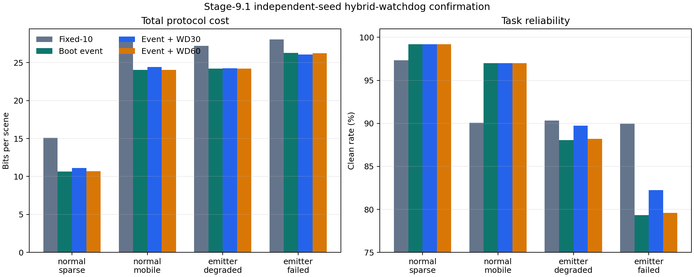

# 阶段9.1启动事件与低频看门狗协议报告

## Material Passport

- Origin Skill: experiment-agent
- Origin Mode: validate
- Origin Date: 2026-07-31
- Verification Status: VERIFIED
- Version Label: stage9_1_validation_v1

## 2026-07-31 后续因果审计更正

阶段9.4端到端标签集成发现，本报告使用的阶段9.1模拟器允许发送端直接读取接收端内部的更新/恢复接受状态和目录状态。这在启动状态发送器退化或完全失效时相当于未计费的反馈信息。

删除该内部真值、要求发送端只依据实际送达的启动状态或看门狗响应获得 boot ID 后，normal_sparse 与 normal_mobile 的结果基本保持不变；emitter_degraded 与 emitter_failed 相对本报告结果分别下降约7.31和13.75个百分点clean。因此，本报告关于“启动发送器退化或失效时HBW30相对boot_event保持正向收益”的结论已被后续证据撤回，不应继续用于论文主张。

本报告保留为历史实验记录。最新证据和原因分析见 `docs/STAGE9_4_END_TO_END_TAGGED_HBW30_FINAL_REPORT.md`。

## 1. 研究结论

阶段9.1完成了协议层的第二步研究：为 S9-BER-v2 的启动事件恢复增加30景低频安全看门狗，形成 S9-HBW30-v1。

独立种子确认表明，该方法通过预注册的双重门槛：

1. 启动状态发送器正常时，相对 fixed10 同时降低总 bit 并提高 clean；
2. 启动状态发送器退化或完全失效时，相对纯 boot_event 提高 clean，且平均 bit 增幅不超过20%；
3. 所有策略错误上下文动作执行次数为0；
4. 真实操作系统进程的冷启动、热重启、目录删除、网络丢弃、延迟旧包和错误版本测试全部通过。

但 S9-HBW30-v1 不是在所有条件下支配 fixed10。启动发送器完全失效时，其 clean 仍比 fixed10 低7.74个百分点。因此它是纯启动事件的低成本容错增强，而不是固定心跳的无条件替代。

## 2. 协议结构

正常路径为：接收端重启后发送64 bit 启动状态，发送端根据目录状态执行64 bit 预安装激活或403 bit 完整安装，然后发送42 bit 当前任务动作并等待24 bit ACK。

后备路径为：若发送端连续30景没有获得更新 ACK、恢复 ACK 或上下文确认，则发送32 bit 探测请求；接收端返回32 bit 状态响应。若发现上下文丢失，则进入相同恢复流程。

60景看门狗仅作为敏感性对照。它没有被允许根据实验结果替换30景主候选。

## 3. 真实进程故障注入

系统实际启动并终止了3个不同 PID 的接收端进程，完成：

- 冷启动后完整码本安装；
- 普通动作更新；
- 网络代理丢弃一次更新；
- 新更新成功后到达的旧更新被拒绝；
- 错误码本版本更新被拒绝；
- 保留持久目录的热重启后，接收端保持不可执行，直到激活恢复；
- 删除持久目录的冷重启后，短激活被拒绝，完整重装成功。

安全违规计数为0。该实验验证真实进程生命周期，不估计真实无人机故障率。

## 4. 独立确认结果

| 故障类型 | fixed10 bit/景 | HBW30 bit/景 | fixed10 clean | HBW30 clean | 主要比较 | 门槛 |
|---|---:|---:|---:|---:|---|---|
| 正常稀疏重启 | 15.107 | 11.138 | 97.32% | 99.20% | 相对 fixed10 节省26.70% bit，clean +1.88 pp | 通过 |
| 正常移动混合 | 27.907 | 24.409 | 90.06% | 97.00% | 相对 fixed10 节省12.84% bit，clean +6.93 pp | 通过 |
| 启动发送器退化 | 27.199 | 24.246 | 90.31% | 89.74% | 相对 boot_event clean +1.70 pp，bit +0.24% | 通过 |
| 启动发送器失效 | 28.072 | 26.090 | 89.96% | 82.22% | 相对 boot_event clean +2.89 pp，bit −0.69% | 通过 |

正常条件下的相对 bit 节省95%置信区间分别为[25.77%，27.67%]和[11.91%，13.84%]。启动发送器退化、失效时，相对 boot_event 的 clean 提升95%置信区间分别为[1.39，2.03]和[2.50，3.31]个百分点。

## 5. 机制解释

启动状态正常时，30景看门狗不会改变恢复结果，只增加少量低频探测开销；因此其 clean 与 boot_event 相同，而 bit 增加约1.65%～4.87%。相对 fixed10，它仍保留明显优势。

启动状态发送器失效时，纯 boot_event 退化为依赖任务更新失败后间接发现重启。30景看门狗增加了独立发现路径，使不可用窗口缩短。完全失效条件下，HBW30 的恢复时延95分位数为23景，纯 boot_event 为28景，fixed10 为10景。

这说明30景看门狗实现的是低开销有限兜底：它降低启动事件单点失效的损害，但其检测上界仍长于 fixed10。

## 6. 统计验证

| 发现 | 方法 | 结果 | 置信度 |
|---|---|---|---|
| 正常条件 bit 优势 | 配对轨迹 bootstrap | 两类区间下限均超过5% | SOLID |
| 正常条件 clean 非劣 | 配对轨迹 bootstrap | 两类差值区间均高于0 | SOLID |
| 启动发送器故障兜底 | 配对轨迹 bootstrap | 两类相对 boot_event 提升区间下限均超过1 pp | SOLID |
| 相对 fixed10 的故障状态可靠性 | 分层直接比较 | 退化时 −0.57 pp，完全失效时 −7.74 pp | CAUTION |
| 实际无人机推广 | 不适用 | 没有真实故障基准率和板载测量 | CAUTION |

### 11类统计谬误审计

- Coverage: 11/11 checked

| 谬误 | 结论 | 说明 |
|---|---|---|
| Simpson 悖论 | 未发现 | 四类故障分别报告，没有合并为单一平均正结果。 |
| 生态谬误 | 未发现 | 推断对象限定为软件轨迹与进程，不推断单架无人机。 |
| Berkson 悖论 | 未发现 | 全部生成轨迹进入统计。 |
| 碰撞变量偏差 | 未发现 | 未根据 clean 或恢复成功事后筛选轨迹。 |
| 基准率忽视 | CAUTION | 启动发送器失效率是压力参数，不是现实发生率；不能加权成部署平均收益。 |
| 均值回归 | 未发现 | 确认轨迹未按开发极端结果选择。 |
| 幸存者偏差 | 未发现 | 无轨迹被丢弃。 |
| 多重搜寻效应 | 已控制 | 30景主设计点和60景敏感性角色在执行前冻结。 |
| 分岔路径花园 | 已控制 | 开发、冻结、确认顺序完整，确认后未改门槛。 |
| 相关不等于因果 | 范围内可接受 | 软件随机实验支持模型内部因果比较，不支持真实硬件外推。 |
| 反向因果 | 未发现 | 协议策略先于故障结果指定。 |

## 7. 可复现性

确认实验使用固定种子和冻结输入哈希。重复运行除完成时间外逐字段完全一致，全项目回归测试全部通过。

- Method: deterministic seeded re-run
- Verdict: REPRODUCIBLE

## 8. 论文贡献边界

本阶段可以作为“可靠任务语义信令协议”章节中的正向结果：启动事件降低常态开销，低频看门狗消除单一事件通道的绝对依赖，序号和版本校验保证 fail-closed。

论文不得写成：

- 已证明真实无人机启动故障率；
- HBW30 在所有故障下优于 fixed10；
- 已完成板载可靠性验证；
- 阶段6外部 Final 已被本实验推翻。

## 9. 下一步

硬件继续暂停。协议层下一步优先研究恢复帧本身，而不继续扫描看门狗间隔：

1. 将 boot ID、catalog epoch、update epoch 和 ACK 组成明确的有限状态机；
2. 验证序号回绕、重复恢复包、双端同时重启和持久文件损坏；
3. 对完整安装拆分为目录校验、最小动作恢复和后台补全；
4. 建立形式化不变量：错误版本动作永不执行、旧 boot 会话永不覆盖新会话；
5. 完成后冻结协议层，不再增加新的周期控制组件。
