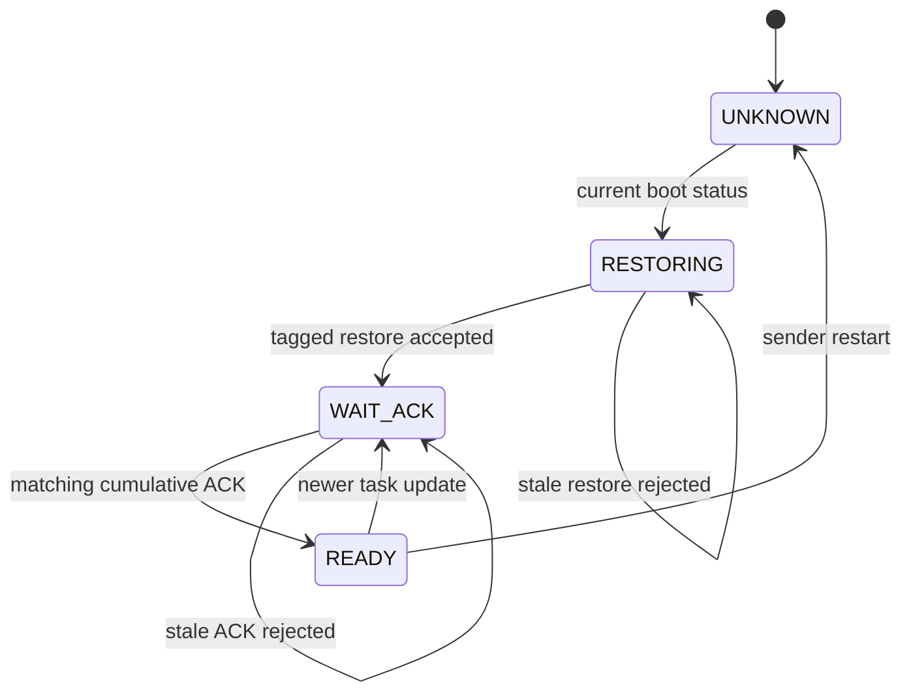

# 阶段9.2恢复有限状态机与安全不变量报告

## Material Passport

- Origin Skill: experiment-agent
- Origin Mode: validate
- Origin Date: 2026-07-31
- Verification Status: VERIFIED
- Version Label: stage9_2_validation_v1

## 1. 研究结论

阶段9.2将此前的工程恢复逻辑整理为可检查的有限状态机，并比较三种会话身份设计。确认结果支持低开销候选 S9-RST16-BL128-v1：只在恢复帧增加16 bit 会话标签，同时强制任何更新或 ACK 的可投递寿命小于128次后续更新，并在恢复会话改变时清空旧队列。

确认深度9下：

- 旧 epoch-only 方案找到两步安全反例；
- 恢复标签方案在寿命有界时完整探索502个状态，无反例；
- 取消寿命界限后找到四步序号回绕反例；
- 所有状态包均携带标签的方案完整探索502个状态，无反例；
- 所有“无反例”检查均未发生状态数截断；
- 确认结果可逐字段复现。

因此，本阶段不是证明旧协议已经绝对安全，而是明确找到了旧协议漏洞，并给出一个安全性—开销折中的候选设计及其必须满足的运行假设。

## 2. 有限状态机

发送端包含 UNKNOWN、RESTORING、WAIT_ACK 和 READY 四种状态。接收端包含未激活和已激活状态，并分别保存 boot ID、目录版本、更新序号和动作来源会话。

会话身份由三个字段共同确定：

> 会话身份 = 发送端控制器代次 + 接收端 boot ID + 目录版本。

更新序号采用模序关系：

> 新序号成立，当且仅当 0 <（新序号 − 旧序号）mod 256 < 128。

这意味着系统必须保证旧包不会在128次或更多后续更新后仍然可投递，否则8 bit 序号本身无法区分“刚刚回绕的新包”和“滞留一个周期的旧包”。

## 3. 冻结安全不变量

模型逐状态检查：

1. 接收端可执行时，目录必须有效；
2. 可执行动作必须来自当前接受的恢复会话；
3. 冷重启后短激活不能代替完整安装；
4. 旧恢复包不能重新激活新的 boot 会话；
5. 旧更新和错误目录更新不能替换当前动作；
6. 旧 ACK 不能把发送端错误推进到 READY；
7. 目录损坏后接收端必须立即 fail-closed。

## 4. 发现的反例

### 4.1 旧协议的两步反例

最短事件序列为：

> 接收端热重启 → 上一个 boot 会话的旧恢复包到达。

若恢复帧没有 boot 会话身份，接收端只能看到合法目录版本和更新序号，可能接受旧恢复动作。这说明目录版本校验不能替代恢复会话校验。

### 4.2 低开销方案的无界反例

最短事件序列为：

> 接收端热重启 → 当前 boot 状态送达 → 当前恢复成功 → 滞留一个完整序号周期的旧更新到达。

旧更新的8 bit 序号在回绕后可能再次表现为“更新”，因此仅给恢复帧加标签并不能在任意包寿命下保证安全。

### 4.3 开发过程中发现的竞态

首次单元检查发现：发送端收到 boot 状态之后、恢复包到达之前，接收端可能再次重启。如果接收端不在恢复包到达时重新核对 boot ID，即使恢复包带标签也可能激活上一 boot 的会话。

该竞态在正式开发模型检查前修正为“恢复接收时二次核对 boot ID 和目录版本”，并被写入冻结候选。

## 5. 开销比较

按1000景、80次普通更新计算：

| 恢复次数 | 旧协议 bit/景 | 恢复标签 bit/景 | 恢复标签增量 | 全标签增量 |
|---:|---:|---:|---:|---:|
| 5 | 5.93 | 6.01 | 0.08 bit/景 | 2.72 bit/景 |
| 20 | 7.88 | 8.20 | 0.32 bit/景 | 3.20 bit/景 |
| 50 | 11.78 | 12.58 | 0.80 bit/景 | 4.16 bit/景 |

恢复标签只在低频恢复时增加16 bit，因此三个注册场景均低于1 bit/景。全标签方案需要普通更新和 ACK 也携带标签，安全假设更少，但持续开销明显更高。

## 6. 设计决策

阶段9.2选择 S9-RST16-BL128-v1 作为后续实现候选，其要求为：

- 恢复帧增加16 bit 会话标签；
- 接收恢复帧时重新核对当前 boot ID 和目录版本；
- 更新和 ACK 保持8 bit 序号；
- 最大可投递包年龄不超过127次后续更新；
- 新恢复会话建立时清空旧发送、接收和延迟队列；
- 目录损坏或身份不一致时 fail-closed。

如果真实通信栈无法保证最大包寿命和队列清理，则必须退回 full_tag16，不能继续使用低开销方案。

## 7. 验证与逻辑审计

### 模型检查结果

| 方案 | 事件模型 | 可达状态 | 反例 | 与预注册一致 |
|---|---|---:|---|---|
| legacy_epoch_only | 无界旧包 | 11 | 有 | 是 |
| restore_tag16 | 包寿命有界 | 502 | 无 | 是 |
| restore_tag16 | 允许序号周期旧包 | 59 | 有 | 是 |
| full_tag16 | 允许序号周期旧包 | 502 | 无 | 是 |

“无反例”只表示在注册事件和深度9范围内没有发现违反不变量的路径，不构成任意深度的数学证明。

### 11类统计与方法谬误审计

- Coverage: 11/11 checked

| 谬误 | 结论 | 说明 |
|---|---|---|
| Simpson 悖论 | 不适用 | 结果按设计和威胁模型分别报告。 |
| 生态谬误 | 未发现 | 不从模型状态推断真实无人机故障率。 |
| Berkson 悖论 | 不适用 | 没有选择性抽样。 |
| 碰撞变量偏差 | 不适用 | 没有回归控制变量。 |
| 基准率忽视 | CAUTION | 模型不包含现实故障基准率，不能计算部署平均风险。 |
| 均值回归 | 不适用 | 无前后测随机变量。 |
| 幸存者偏差 | 未发现 | 所有可达状态均纳入，截断时禁止判为通过。 |
| 多重搜寻效应 | 已控制 | 四种预期判断模式执行前注册。 |
| 分岔路径花园 | 已控制 | 开发深度、确认深度、事件和不变量均预注册。 |
| 相关不等于因果 | CAUTION | 状态机内部反例具有构造因果关系，但不能直接外推实现概率。 |
| 反向因果 | 未发现 | 事件顺序在反例路径中明确。 |

## 8. 可复现性

- Method: deterministic exhaustive bounded exploration
- Verdict: REPRODUCIBLE

确认与复现结果除 UTC 完成时间外逐字段一致，全项目回归测试全部通过。

## 9. 证据边界与下一步

当前候选尚未写入正式二进制 codec，也没有证明16 bit 标签的碰撞安全或恶意攻击安全。下一步阶段9.3应：

1. 定义恢复帧 v2 的实际二进制字段；
2. 将16 bit 会话标签接入真实接收端工作进程；
3. 实现127更新包寿命门槛和恢复时队列清空；
4. 用旧包、回绕包、重复恢复包和双端重启做进程级故障注入；
5. 对42 bit 普通更新保持不变，只增加低频恢复开销；
6. 完成后冻结协议层，不继续增加身份字段。

