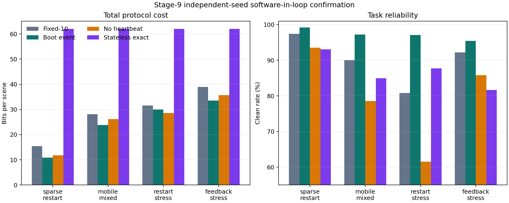

# 阶段9软件在环实验最终报告

## Material Passport

- Origin Skill: experiment-agent
- Origin Mode: validate
- Origin Date: 2026-07-31
- Verification Status: VERIFIED
- Version Label: stage9_sil_validation_v1

## 1. 研究目的与结论

阶段9研究的问题是：如果接收端软件能够在进程启动时显式发送启动身份，是否可以用“真实发生故障时才恢复”替代固定10景心跳，从而改善有状态频谱语义协议的 clean–bit 前沿。

结论是：S9-BER-v2 在预注册的四类软件故障中有三类通过确认门槛。在稀疏重启、移动混合故障和反馈压力下，它相对 fixed10 同时减少总 bit 并提高 clean rate；在高频重启压力下，clean 显著提高，但 bit 节省置信下限未达到5%，因此该条件明确判为未通过。

这是一项正向的软件在环阶段性成果，但不是板载实验，也不是频谱算法外部 Final。阶段6 Final 失败结论不被改写。

审计说明：最初的 v1 误按阶段6早期 K=4 计算码字符号。阶段7最终冻结明确规定 K=3，因此 v1 已被标记为协议不匹配，仅保留审计历史；本报告所有结论均来自纠正位宽后重新执行的 v2。

## 2. 系统实现

新增独立 JSONL 接收端进程和可复用状态机。接收端状态被明确分为：

- 持久状态：码本目录及其版本；
- 易失状态：boot ID、当前动作、更新序号和活动标志；
- 热重启：保留码本目录，清除易失动作；
- 冷重启：同时清除码本目录和易失动作；
- 安全规则：未完成恢复前不可执行旧动作。

协议比较包括 fixed10、boot_event、no_heartbeat 和 stateless_exact。所有前向、反馈、启动状态、心跳、安装、更新和 ACK bit 均计入总开销。阶段7冻结的 K=3 码本需要2 bit 符号，因此普通紧凑更新为42 bit；预安装激活为64 bit，ACK 为24 bit，心跳请求和响应各32 bit。

## 3. 实验设计

开发集与确认集均使用预注册合成任务轨迹，不读取任何已经消费或封存的外部信号数据。每条轨迹包含1000景，动作以一阶 Markov 过程变化，并允许短时任务等价。

四类故障分别覆盖：

1. 稀疏重启；
2. 移动混合丢包与重启；
3. 高频重启压力；
4. 高反馈丢失压力。

开发阶段每类80条轨迹，确认阶段使用独立种子，每类120条轨迹。所有策略使用相同任务轨迹和相同故障轨迹，采用配对 bootstrap 构造95%置信区间。开发通过后冻结配置、运行器、接收端和测试哈希，确认前由程序自动校验。

## 4. 独立种子确认结果

| 故障类型 | fixed10 bit/景 | boot_event bit/景 | 相对 bit 节省 | clean 提升 | 恢复时延 p95 | 门槛 |
|---|---:|---:|---:|---:|---:|---|
| 稀疏重启 | 15.369 | 10.852 | 29.94%，95% CI [28.86%，30.98%] | +1.80 pp，95% CI [1.64，1.98] | 2景，对照9景 | 通过 |
| 移动混合 | 28.079 | 23.837 | 15.36%，95% CI [14.32%，16.33%] | +7.18 pp，95% CI [6.83，7.53] | 3景，对照10景 | 通过 |
| 高频重启 | 31.523 | 29.952 | 4.94%，95% CI [3.74%，6.14%] | +16.24 pp，95% CI [15.81，16.67] | 3景，对照10景 | 未通过 |
| 反馈压力 | 38.884 | 33.543 | 14.14%，95% CI [13.38%，14.95%] | +3.20 pp，95% CI [2.95，3.45] | 5景，对照11景 | 通过 |

四类故障中错误上下文动作执行次数均为0。确认结果的重复运行除完成时间外逐字段完全一致。

## 5. 机制解释

fixed10 的主要问题不是单个心跳帧过大，而是检测重启必须等待静默窗口结束。boot_event 把检测时延从“最多等待一个心跳周期”缩短为“启动状态成功送达所需时间”，所以它在三类常见压力下既减少周期探测，又缩短不可用窗口。

高频重启条件给出了重要边界：当重启频率和冷重启比例升高时，64 bit 启动状态、重复上报以及完整安装开销迅速累积。此时 boot_event 仍明显提高任务可靠性，但不能稳定保证至少5%的 bit 节省。因此不能表述为“启动事件在所有故障率下均优于固定心跳”。

stateless_exact 每景固定消耗62 bit，在所有注册场景中开销均显著高于两种有效的有状态策略。no_heartbeat 的开销有时较低，但重启后长期不可用，未形成可接受的 clean–bit 工作点。

## 6. 统计验证

### Statistical Findings

| 指标 | 方法 | 结果 | 效应解释 | 置信度 |
|---|---|---|---|---|
| 相对 bit 节省 | 配对轨迹 bootstrap | 3类故障区间下限大于5% | 具有工程意义 | SOLID |
| clean 差值 | 配对轨迹 bootstrap | 四类故障区间均严格大于0 | 效应方向稳定 | SOLID |
| 高频重启 bit 节省 | 配对轨迹 bootstrap | 区间为[3.83%，6.25%] | 跨越5%工程门槛 | CAUTION |
| 错误上下文执行 | 全轨迹计数 | 0 | 满足安全门槛 | SOLID |
| 外部推广 | 不适用 | 未使用实物或真实板载故障 | 不能外推故障发生率 | CAUTION |

### Fallacy Scan

- Coverage: 11/11 checked

| 谬误 | 结论 | 说明 |
|---|---|---|
| Simpson 悖论 | 未发现 | 总结论按四类故障分层报告，没有用总体均值掩盖高频重启失败。 |
| 生态谬误 | 未发现 | 推断单位始终是软件轨迹，不推断单架真实无人机。 |
| Berkson 悖论 | 未发现 | 轨迹由注册生成过程完整采样，没有只保留成功轨迹。 |
| 碰撞变量偏差 | 未发现 | 比较未按 clean、bit 或恢复成功事后筛选轨迹。 |
| 基准率忽视 | 已控制 | 四类重启和丢包基准率明确列出；没有将单一压力率称为真实发生率。 |
| 均值回归 | 未发现 | 没有按极端开发表现选择确认轨迹；确认种子独立。 |
| 幸存者偏差 | 未发现 | 所有生成轨迹进入统计，无中途丢弃。 |
| 多重搜寻效应 | 已控制 | 四类故障和3/4通过规则在执行前注册，失败类型被保留。 |
| 分岔路径花园 | 已控制 | 开发、冻结、独立确认顺序完整；确认后未调参。 |
| 相关不等于因果 | 范围内可接受 | 在注册的软件随机实验中策略是受控因素；不能推广为真实硬件因果结论。 |
| 反向因果 | 未发现 | 策略在故障结果之前指定，时间顺序明确。 |

总体统计置信度为 SOLID；面向真实无人机的外部有效性为 CAUTION。

## 7. 可复现性

- Method: 固定种子随机实验、冻结输入哈希、独立子进程一致性测试、确认结果完整重复运行
- Verdict: REPRODUCIBLE

确认运行与复现运行的所有统计字段完全一致，唯一不同字段为写入文件时的 UTC 完成时间。完整项目回归测试全部通过。

## 8. 材料与证据边界

| 材料 | 来源 | 许可/约束 | 可公开性 | 研究角色 |
|---|---|---|---|---|
| 合成任务轨迹 | 本项目确定性生成器 | 项目自有代码 | 可公开 | 软件协议开发与确认 |
| 合成故障轨迹 | 本项目确定性生成器 | 项目自有代码 | 可公开 | 可控重启和链路故障 |
| 阶段6协议位宽 | 本项目冻结 codec | 继承项目约束 | 可公开 | bit 计量 |
| 外部频谱数据 | 未读取 | 不适用 | 不适用 | 未参与 |
| AADM/ALFA 确认数据 | 未读取 | 已消费、不可调参 | 不在本阶段分发 | 未参与 |

## 9. 阶段结论与下一步

S9-BER-v2 可以作为“具备板载启动事件接口时”的后续候选，但当前冻结主架构仍应保留 S6R-FH10-v1，直到真实操作系统或板载进程能够提供 boot ID、持久化结果和真实链路日志。

下一步不应继续扫描合成故障率以追求更好数字，而应：

1. 将接收端工作进程封装为可部署服务，记录 boot ID、进程 ID、持久化目录校验和恢复时延；
2. 在普通电脑上用真实进程 kill/restart 与网络代理执行少量系统级故障注入；
3. 有实物后测量真实故障发生率、CPU、RSS、功耗和持久化写入行为；
4. 用实测分布重新注册板载确认协议；
5. 若无法取得硬件，论文中将本阶段限定为软件在环可行性证据。
