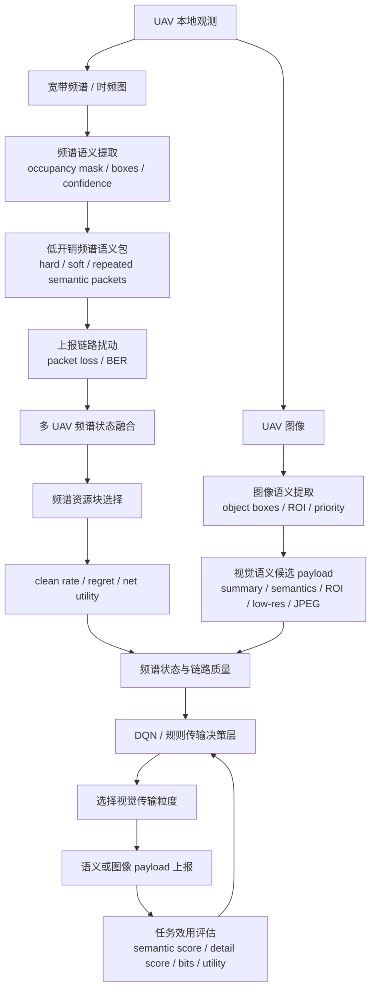

# 面向低空 UAV 的频谱感知多模态语义通信系统闭环

## 1. 闭环目标

本项目当前系统已经从单一的“频谱语义压缩”扩展为“频谱语义感知 + 多 UAV 资源优化 + UAV 图像语义传输决策”的多模态闭环。闭环目标不是恢复完整 I/Q、完整频谱图或完整图像，而是在受限空地链路下传输对任务最有价值的语义信息，使系统在较低通信开销下完成频谱资源选择和视觉任务信息回传。

系统核心问题可以表述为：

> 在低空 UAV 网络中，机载平台同时获得宽带频谱观测和视觉观测。当空地链路存在丢包、误码和带宽限制时，系统应如何根据频谱状态决定视觉语义的传输粒度，从而最大化任务效用并控制通信开销？

因此，系统闭环包含两个层次：

1. 频谱闭环：由时频观测生成频谱占用语义，并服务多 UAV 频谱资源选择；
2. 多模态闭环：由频谱资源状态驱动图像语义、ROI 或低分辨率图像的自适应传输。

## 2. 系统总体闭环



这个闭环的关键是：频谱语义不只是一个独立检测结果，而是进入决策层，决定图像侧应该传什么、传多少、是否值得传更细节的信息。

## 3. 各模块输入输出

| 模块 | 输入 | 输出 | 当前实现 |
|---|---|---|---|
| 频谱语义提取 | RadDet 128×128 时频图 | 频谱占用 mask、占用框、语义 bit 数 | `TinyOccupancyCNN` + connected components |
| 频谱语义上报 | 占用框 / 置信度 | hard/soft semantic packet | 支持重复保护和链路扰动仿真 |
| 多 UAV 频谱融合 | 多架 UAV 的语义包 | 共享频谱占用状态 | 资源块占用融合 |
| 资源选择 | 频谱占用状态 | 最优连续资源块 | clean rate、regret、net utility 评价 |
| 图像语义提取 | VisDrone UAV 图像 | 目标框、ROI、优先级、payload 估计 | GT 语义统计、zero-shot detector、ROI-mask baseline |
| 多模态决策层 | 频谱 clean rate、packet loss、BER、视觉优先级、payload 大小 | 视觉传输动作 | 规则策略 + DQN/contextual-bandit |
| 任务效用评估 | 动作、链路状态、payload bit 数 | utility、semantic score、detail score | 统一效用函数 |

## 4. 频谱闭环当前状态

频谱部分已经完成第一版闭环：

```text
RadDet 时频图
→ 频谱占用语义检测
→ hard / soft 语义包上报
→ 丢包 / 误码链路仿真
→ 多 UAV 频谱状态融合
→ 连续频谱资源块选择
→ clean rate / regret / net utility 评估
```

代表性结果为：

| 条件 | 方法 | clean rate | net utility | bits/decision-step |
|---|---|---:|---:|---:|
| 4 UAV, packet loss=0.2, BER=1e-4 | random | 0.6968 | 0.9787 | 0 |
| 4 UAV, packet loss=0.2, BER=1e-4 | spectrogram8_rep3_partial | 0.9310 | 0.9915 | 1,966,080 |
| 4 UAV, packet loss=0.2, BER=1e-4 | semantic_hard_rep3 | 0.9308 | 0.9917 | 3,137.7 |
| 4 UAV, packet loss=0.2, BER=1e-4 | oracle | 0.9440 | 0.9930 | 0 |

这说明当前频谱语义上报不仅能显著降低开销，而且能在资源选择任务上接近完整频谱图 partial/repetition 基线和 oracle 上界。

## 5. 图像语义侧当前状态

图像侧使用 VisDrone UAV 图像作为现实低空视觉任务数据。当前图像语义主要包括：

1. 目标级语义：目标框、类别、数量、优先级；
2. 区域级语义：ROI 区域面积、是否需要补传细节；
3. payload 级语义：语义框、ROI patch、低分辨率图像、完整 JPEG 的 bit 数估计。

当前图像语义提取模型仍然偏弱，因此图像侧暂时更适合作为决策层输入和 payload 账本，而不是最终高精度目标检测模型。已有结论是：

- VisDrone 完整 JPEG 平均约 1.19 Mbit/frame；
- GT 视觉语义框约 5.3 kbit/frame；
- JPEG/语义开销比约 223×；
- 当前 ROI-mask baseline F1 约 0.2725，只能作为初始基线；
- 后续需要用 YOLOv8n/YOLOv5n 微调或网格级视觉语义模型提升视觉语义质量。

## 6. DQN 决策层并入闭环

### 6.1 DQN 在系统中的位置

DQN 决策层位于“频谱资源选择结果”和“图像语义 payload 选择”之间。它不替代频谱检测器，也不替代图像检测器，而是完成跨层决策：

```text
频谱状态 + 链路质量 + 图像任务重要性 + 候选 payload 开销
→ DQN 决策层
→ 选择视觉语义传输粒度
```

当前实现更准确地说是单步 DQN / contextual-bandit。原因是当前每一帧的动作不会显式改变下一帧环境状态，因此奖励可以直接定义为当前动作的任务效用。后续如果加入队列长度、时延累积、历史频谱状态和重传缓存，可以自然扩展为多步 MDP。

### 6.2 状态空间

当前 DQN 状态包括：

| 状态维度 | 含义 |
|---|---|
| clean rate | 当前频谱资源选择可靠性 |
| packet loss | 上报链路丢包率 |
| BER | 链路误码率 |
| high-priority flag | 当前图像是否包含高优先级目标 |
| priority-object density | 高优先级目标密度 |
| object density | 图像目标密度 |
| ROI area | ROI 面积占比 |
| semantic payload size | 视觉语义包大小 |
| ROI payload size | ROI 补传开销 |
| low-resolution payload size | 低分辨率图像开销 |
| JPEG payload size | 完整图像开销 |

### 6.3 动作空间

| 动作 | 含义 | 适用情况 |
|---|---|---|
| `summary_only` | 只上传极简摘要 | 链路很差或图像优先级低 |
| `semantic_only` | 上传目标框/类别等视觉语义 | 中等或较差链路下的主动作 |
| `semantic_plus_roi` | 上传视觉语义 + ROI patch | 链路较好且存在关键区域 |
| `lowres_plus_semantic` | 上传视觉语义 + 低分辨率图像 | 链路较好且需要场景上下文 |
| `jpeg_full` | 上传完整 JPEG | 仅在链路非常好且任务确有需要时考虑 |

### 6.4 奖励函数

当前奖励与规则策略使用同一套效用函数：

```text
utility = expected_task_value - bit_cost_per_mbit × transmitted_mbits
```

其中 `expected_task_value` 同时考虑：

- payload 是否成功送达；
- 是否传输了任务所需视觉语义；
- 是否为高优先级目标提供了细节；
- 链路丢包、误码和 payload 大小对送达概率的影响。

这样可以保证 DQN、规则策略和 oracle 使用同一评价标准，避免“训练目标”和“报告指标”不一致。

## 7. DQN 闭环实验结果

当前 DQN 训练脚本为：

```text
scripts/train_multimodal_dqn_policy.py
```

输出结果为：

```text
results/phase1/multimodal_dqn_policy.md
results/phase1/multimodal_dqn_policy.csv
results/phase1/multimodal_dqn_policy.json
results/phase1/multimodal_dqn_policy.pt
```

在 `semantic_hard_rep3` 频谱语义方案下，DQN 与规则策略、oracle 的对比如下：

| packet loss | 方法 | bits/frame | utility | priority detail | 主要动作 |
|---:|---|---:|---:|---:|---|
| 0.00 | semantic_only | 5,135.1 | 1.7810 | 0.0000 | 只传视觉语义 |
| 0.00 | spectrum_rule | 44,928.7 | 3.7214 | 0.9064 | 主要传低分辨率图像 + 语义 |
| 0.00 | DQN | 47,583.5 | 3.8463 | 0.9061 | 主要传低分辨率图像 + 语义 |
| 0.00 | oracle | 47,457.4 | 3.8473 | 0.9064 | 理想上界 |
| 0.05 | spectrum_rule | 43,073.3 | 2.4241 | 0.5599 | 主要传低分辨率图像 + 语义 |
| 0.05 | DQN | 44,024.3 | 2.4626 | 0.5599 | 接近 oracle |
| 0.10 | spectrum_rule | 17,636.0 | 1.7112 | 0.1871 | 语义为主，少量细节 |
| 0.10 | DQN | 17,584.6 | 1.7352 | 0.1832 | 接近 oracle |
| 0.20 | spectrum_rule | 6,540.9 | 1.3605 | 0.0075 | 基本退回语义 |
| 0.20 | DQN | 7,039.0 | 1.3697 | 0.0117 | 基本退回语义 |
| 0.20 | oracle | 6,617.9 | 1.3699 | 0.0075 | 理想上界 |

实验现象符合系统预期：

1. 链路较好时，DQN 主动发送低分辨率图像或 ROI 细节，使高优先级目标获得更多信息；
2. 链路变差时，DQN 自动退回 `semantic_only`，减少大 payload 失败风险；
3. DQN 在多个 packet loss 条件下接近 oracle，并优于手工规则策略；
4. DQN 没有盲目选择完整 JPEG，说明 bit 成本和送达概率约束有效。

## 8. 弱视觉模型接入闭环的当前结果

考虑到当前设备显存约 2GB，本阶段没有直接训练较大的 YOLO/Transformer 检测器，而是先使用已有轻量 ROI-mask 作为真实可运行的弱视觉前端。该模型只输出粗 ROI/occupancy 语义，不可靠输出类别，因此它不是最终视觉模型，而是用于验证“真实预测视觉语义能否接入闭环”的硬件安全 baseline。

当前已完成如下实验：

```text
VisDrone 图像
→ TinyOccupancyCNN ROI-mask 预测
→ 连通区域转视觉语义框
→ 估计语义 payload
→ 输入规则策略 / DQN 决策层
→ 根据真实标注评价任务效用
```

代表性结果如下，频谱方案为 `semantic_hard_rep3`，packet loss = 0.2：

| 视觉来源 | 策略 | bits/frame | utility | semantic score | priority detail | 视觉语义质量 |
|---|---|---:|---:|---:|---:|---:|
| GT annotation 上界 | DQN | 5,635.6 | 1.3794 | 0.7740 | 0.0083 | 1.0000 |
| GT annotation 上界 | oracle | 5,511.7 | 1.3796 | 0.7774 | 0.0070 | 1.0000 |
| ROI-mask 128 class-agnostic | DQN | 2,489.3 | 0.3466 | 0.2028 | 0.0015 | 0.2308 |
| ROI-mask 128 priority-proxy | DQN | 2,445.4 | 0.3469 | 0.2030 | 0.0015 | 0.2308 |

该结果说明：

1. 当前弱视觉模型可以安全接入系统闭环，2GB 显存下可运行；
2. 由于 ROI-mask 的召回和类别语义不足，真实任务效用明显低于 GT 视觉语义上界；
3. DQN 在弱视觉输入下仍能稳定选择动作，主要选择 `semantic_only`，没有因为弱输入而盲目传大图；
4. 当前系统的主要瓶颈已经从“闭环是否能跑通”转为“视觉语义前端质量是否足够好”；
5. 后续升级设备后，只需要替换视觉语义提取器，再复用同一套闭环和 DQN 评价脚本。

本阶段也尝试了 256×256 ROI-mask 训练，训练过程没有发生显存溢出，但测试 F1 低于原 128×128 baseline。因此当前暂时保留 128×128 ROI-mask 作为弱视觉 baseline，后续优先切换到轻量 YOLO 微调，而不是继续堆高 ROI-mask 分辨率。

## 9. 轻量 YOLO 前端的准备状态

为了后续在更好设备上替换弱 ROI-mask，本阶段已经完成 VisDrone 到 YOLO 格式的数据准备和闭环适配接口。当前没有直接训练 YOLO，是因为本机 GPU 为 2GB MX450，优先避免显存溢出和无效长时间训练。

当前新增的数据准备流程为：

```text
VisDrone 原始标注
→ 筛选任务相关优先级目标
→ 转换为 YOLO normalized bbox 格式
→ 生成 train / val / test 划分
→ 生成 2GB-safe YOLOv8n 训练命令
```

默认保留的任务相关类别为：

```text
pedestrian, people, car, van, truck, bus, motor
```

生成的数据集位于：

```text
data/processed/visdrone_yolo_priority/
```

数据统计如下：

| Split | Frames | Boxes | Mean boxes/frame | Nonempty ratio |
|---|---:|---:|---:|---:|
| train | 411 | 26,572 | 64.65 | 1.000 |
| val | 68 | 4,830 | 71.03 | 1.000 |
| test | 69 | 4,493 | 65.12 | 1.000 |

同时已准备 YOLO 输出接入闭环的适配脚本：

```text
scripts/evaluate_yolo_visual_closed_loop.py
```

该脚本读取 YOLO prediction txt 文件，将其转为视觉语义框，再接入现有频谱感知 DQN 决策层。因此后续训练出 YOLOv8n/YOLOv5n 后，只需要把预测结果放入指定目录，即可复用当前闭环评价。

为了验证接口正确性，本阶段使用转换后的 YOLO GT 标签构造了一个 `gt_priority_all` 伪预测目录，并完成 sanity check。该 sanity check 只证明接口和闭环评价链路可运行，不代表真实 YOLO 模型性能。真实模型性能需要后续训练后再重新评估。

随后，本阶段进一步安装了 `ultralytics`，并在当前 NVIDIA MX450 2GB GPU 上完成了 YOLOv8n 的 1-epoch smoke training。保守配置为：

```text
imgsz = 256
batch = 1
epochs = 1
workers = 0
amp = True
output = C:\yolo_visdrone_runs
```

训练可以跑通，Ultralytics 报告的 GPU 显存约为 0.15 GB，没有发生 OOM。由于当前项目路径包含中文字符，Ultralytics 保存目录改用纯英文路径 `C:\yolo_visdrone_runs`；同时将普通 `polars` 替换为 `polars-lts-cpu` 以避免 `unknown feature flag: 'sse3'` 兼容性错误。

1-epoch smoke 模型的验证结果较弱：

| 指标 | 结果 |
|---|---:|
| Precision | 0.757 |
| Recall | 0.0302 |
| mAP50 | 0.0197 |
| mAP50-95 | 0.00722 |

这说明当前训练只证明“能跑”，不能作为最终视觉检测器。将该 YOLO smoke 模型预测结果接入闭环后，在 `semantic_hard_rep3`、packet loss = 0.2 下：

| 视觉前端 | 策略 | utility | semantic score | 视觉语义质量 |
|---|---|---:|---:|---:|
| YOLOv8n smoke, 1 epoch | DQN | 0.3907 | 0.2231 | 0.2522 |
| ROI-mask 128 | DQN | 0.3466 | 0.2028 | 0.2308 |
| GT annotation 上界 | DQN | 1.3794 | 0.7740 | 1.0000 |

因此，当前 YOLO smoke 模型略好于 ROI-mask，但距离 GT 上界仍很远。它的价值主要在于证明：即使在 2GB 显存设备上，也可以用轻量 YOLO 前端完成训练、预测和闭环接入；后续若增加训练轮数或升级设备，视觉前端可直接替换而不改变频谱语义和 DQN 决策模块。

在此基础上，本阶段进一步将 epoch 从 1 提高到 5，仍保持 `imgsz=256, batch=1, workers=0, amp=True`。训练同样顺利完成，Ultralytics 报告的峰值显存约为 0.215 GB，仍远低于 2GB。5-epoch 结果如下：

| 训练轮数 | Precision | Recall | mAP50 | mAP50-95 |
|---:|---:|---:|---:|---:|
| 1 | 0.7576 | 0.0303 | 0.0198 | 0.0073 |
| 5 | 0.6472 | 0.0415 | 0.0296 | 0.0116 |

将 5-epoch YOLOv8n 预测结果接入闭环后，在 `semantic_hard_rep3`、packet loss = 0.2 下：

| 视觉前端 | 策略 | utility | semantic score | 视觉语义质量 |
|---|---|---:|---:|---:|
| ROI-mask 128 | DQN | 0.3466 | 0.2028 | 0.2308 |
| YOLOv8n 1 epoch | DQN | 0.3907 | 0.2231 | 0.2522 |
| YOLOv8n 5 epochs | DQN | 0.5097 | 0.2920 | 0.3299 |
| GT annotation 上界 | DQN | 1.3794 | 0.7740 | 1.0000 |

这说明增加训练轮数后，YOLO 前端已经明显超过 ROI-mask baseline；但由于输入分辨率低、batch 小、训练数据有限且目标密集细小，距离 GT 上界仍有较大差距。

随后进一步将输入分辨率从 256 提高到 320，仍保持 `batch=1, epochs=5, workers=0, amp=True`。该配置同样未发生显存溢出，Ultralytics 报告的峰值显存约为 0.238 GB。验证结果为：

| setting | precision | recall | mAP50 | mAP50-95 |
|---|---:|---:|---:|---:|
| YOLOv8n, 256, 5 epochs | 0.6472 | 0.0415 | 0.0296 | 0.0116 |
| YOLOv8n, 320, 5 epochs | 0.2548 | 0.0601 | 0.0451 | 0.0190 |

320 输入下 precision 下降，但 recall 和 mAP 明显提高。对于当前语义传输闭环，漏检目标会直接降低视觉语义质量，因此该变化总体是有利的。将 320 模型预测结果接入闭环后，在 `semantic_hard_rep3`、packet loss = 0.2 下：

| 视觉前端 | 策略 | bits/frame | utility | semantic score | 视觉语义质量 |
|---|---|---:|---:|---:|---:|
| ROI-mask 128 | DQN | 2,489.3 | 0.3466 | 0.2028 | 0.2308 |
| YOLOv8n 1 epoch, 256 | DQN | 2,403.4 | 0.3907 | 0.2231 | 0.2522 |
| YOLOv8n 5 epochs, 256 | DQN | 2,451.9 | 0.5097 | 0.2920 | 0.3299 |
| YOLOv8n 5 epochs, 320 | DQN | 3,080.3 | 0.6078 | 0.3467 | 0.4007 |
| GT annotation 上界 | DQN | 5,635.6 | 1.3794 | 0.7740 | 1.0000 |

因此，320 输入已经证明：提高视觉语义质量会直接提升频谱感知语义传输闭环的任务效用。不过从显存占用看，该配置仍偏保守。随后继续测试了更激进的 `YOLOv8n, imgsz=512, batch=2, epochs=5` 和 `YOLOv8n, imgsz=640, batch=2, epochs=5`，两者均在当前 2GB MX450 GPU 上顺利完成训练，没有发生 OOM。

| setting | precision | recall | mAP50 | mAP50-95 | peak GPU memory |
|---|---:|---:|---:|---:|---:|
| YOLOv8n, 320, batch 1, 5 epochs | 0.2548 | 0.0601 | 0.0451 | 0.0190 | 0.238 GB |
| YOLOv8n, 512, batch 2, 5 epochs | 0.3220 | 0.1530 | 0.1000 | 0.0490 | 0.625 GB |
| YOLOv8n, 640, batch 2, 5 epochs | 0.2390 | 0.1940 | 0.1310 | 0.0664 | 0.830 GB |

将 512/640 模型预测结果接入闭环后，在 `semantic_hard_rep3`、packet loss = 0.2 下：

| 视觉前端 | 策略 | bits/frame | utility | semantic score | 视觉语义质量 |
|---|---|---:|---:|---:|---:|
| YOLOv8n 5 epochs, 320 | DQN | 3,080.3 | 0.6078 | 0.3467 | 0.4007 |
| YOLOv8n 5 epochs, 512, batch 2 | DQN | 3,925.0 | 0.7802 | 0.4414 | 0.5308 |
| YOLOv8n 5 epochs, 640, batch 2 | DQN | 4,871.3 | 0.8948 | 0.5084 | 0.6348 |
| GT annotation 上界 | DQN | 5,635.6 | 1.3794 | 0.7740 | 1.0000 |

可以看到，640 输入虽然带来更多预测框和更高语义 payload，但 utility 仍然继续提升，说明新增目标语义对任务有效，而不是单纯增加通信开销。因此，继续在 640 输入下将训练轮数从 5 提高到 10：

| setting | precision | recall | mAP50 | mAP50-95 | peak GPU memory |
|---|---:|---:|---:|---:|---:|
| YOLOv8n, 640, batch 2, 5 epochs | 0.2390 | 0.1940 | 0.1310 | 0.0664 | 0.830 GB |
| YOLOv8n, 640, batch 2, 10 epochs | 0.2760 | 0.2360 | 0.1580 | 0.0809 | 0.662 GB |

10 epoch 模型接入闭环后，在 `semantic_hard_rep3`、packet loss = 0.2 下：

| 视觉前端 | 策略 | bits/frame | utility | semantic score | 视觉语义质量 | pred boxes |
|---|---|---:|---:|---:|---:|---:|
| YOLOv8n 5 epochs, 640, batch 2 | DQN | 4,871.3 | 0.8948 | 0.5084 | 0.6348 | 60.6 |
| YOLOv8n 10 epochs, 640, batch 2 | DQN | 6,658.8 | 0.9719 | 0.5535 | 0.7432 | 85.4 |
| GT annotation 上界 | DQN | 5,635.6 | 1.3794 | 0.7740 | 1.0000 | 70.8 |

因此，在当前设备上，`YOLOv8n, imgsz=640, batch=2, epochs=10` 是目前最优的可部署视觉前端 baseline。不过它的预测框数量已经超过 GT annotation 平均框数，语义 payload 也高于 GT 上界对应的 payload，说明下一步主要瓶颈已经从“视觉模型能否检测出目标”转为“如何抑制冗余低置信框并控制语义 payload”。

为此，基于同一批 10 epoch / 640 预测结果，先进行两类无需重新训练的语义打包消融：仅提高置信度阈值，以及在保留低阈值 `0.05` 的前提下每帧仅保留置信度最高的 top-k 个框。结果均在 `semantic_hard_rep3`、packet loss = 0.2、DQN 策略下计算：

| 语义打包方式 | 平均框数 | bits/frame | utility | semantic score | 视觉语义质量 |
|---|---:|---:|---:|---:|---:|
| 无截断，conf=0.05 | 85.4 | 6,658.8 | 0.9719 | 0.5535 | 0.7432 |
| 仅提高阈值，conf=0.08 | 63.4 | 4,983.4 | 0.9352 | 0.5328 | 0.6685 |
| 仅提高阈值，conf=0.15 | 41.3 | 3,656.2 | 0.8155 | 0.4606 | 0.5458 |
| 低阈值 + top-k=40 | 37.1 | 3,176.4 | 0.8059 | 0.4613 | 0.5453 |
| 低阈值 + top-k=60 | 52.0 | 4,253.5 | 0.9126 | 0.5206 | 0.6349 |
| 低阈值 + top-k=70 | 58.3 | 4,708.6 | 0.9310 | 0.5307 | 0.6636 |
| **低阈值 + top-k=80** | **63.8** | **5,105.5** | **0.9613** | **0.5476** | **0.6861** |

`top-k=80` 是当前最合理的部署点：相较无截断，平均语义载荷下降 **23.3%**，而 DQN utility 仅下降 **1.1%**。这表明低置信框确实含有部分有效召回信息，直接提高阈值会损失更多任务语义；从低阈值候选中按置信度截断，能更好地体现“面向传输预算的语义选择”。闭环适配器现已支持 `--max-boxes-per-frame`，后续可在不同链路预算下动态调节该值。下一步不应简单继续堆 epoch，而应把 top-k 从固定规则进一步升级为与频谱 clean rate、队列和任务优先级关联的自适应预算。

还测试了更严格的检测端 NMS（预测阶段 IoU 从 `0.70` 改为 `0.50`）。在当前模型和 `conf=0.05` 下，平均框数、视觉语义质量和闭环结果与原配置完全一致，说明冗余并非主要来自可由该范围 NMS 消除的高度重叠框，而是来自不同位置的低置信候选。因此当前保留默认 NMS，并优先采用 top-k 语义预算；可复现预测导出脚本为 `scripts/export_visdrone_yolo_predictions.py`。

随后在 2GB MX450 上完成了最终视觉训练：`YOLOv8s, imgsz=640, batch=1, 30 epochs`。较大的 YOLOv8s 在 AMP 混合精度下会出现 NaN loss，因此最终配置关闭 AMP；训练全程显存约 1.25GB，未出现 OOM。最佳 checkpoint 出现在 epoch 27：

| 视觉模型 | precision | recall | mAP50 | mAP50-95 | 权重大小 |
|---|---:|---:|---:|---:|---:|
| YOLOv8n, 640, batch 2, 10 epochs | 0.2760 | 0.2360 | 0.1580 | 0.0809 | 6.2 MB |
| **YOLOv8s, 640, batch 1, 30 epochs, AMP off** | **0.4872** | **0.3553** | **0.3443** | **0.1834** | **21.5 MB** |

将 YOLOv8s 的真实预测接入相同闭环后，较大模型的低阈值输出平均达到 127.1 个框，不能直接作为高效语义 packet。top-k 截断的结果为：

| 视觉前端与语义打包 | 平均框数 | bits/frame | utility | semantic score | 视觉语义质量 |
|---|---:|---:|---:|---:|---:|
| YOLOv8n 10 epoch，conf=0.05，无截断 | 85.4 | 6,658.8 | 0.9719 | 0.5535 | 0.7432 |
| YOLOv8n 10 epoch，conf=0.05，top-k=80 | 63.8 | 5,105.5 | 0.9613 | 0.5476 | 0.6861 |
| YOLOv8s 30 epoch，conf=0.05，无截断 | 127.1 | 9,712.3 | 0.9998 | 0.5696 | 0.8614 |
| YOLOv8s 30 epoch，conf=0.05，top-k=60 | 54.2 | 4,361.5 | 0.9713 | 0.5539 | 0.6810 |
| **YOLOv8s 30 epoch，conf=0.05，top-k=80** | **69.5** | **5,474.9** | **1.0305** | **0.5870** | **0.7471** |

因此，最终部署视觉前端更新为 **YOLOv8s, 640, batch 1, 30 epochs, AMP off + conf=0.05 + top-k=80**。它相较原 YOLOv8n top-k baseline 仅增加约 7.2% 的语义 bit 开销，却将闭环 utility 从 0.9613 提升至 1.0305，并且检测 mAP50-95 提升超过一倍。该结论同时说明：模型能力提升必须与语义 packet 预算共同优化；直接发送全部检测框反而不如预算化 top-k 语义传输有效。

## 10. 当前闭环能够支持的研究结论

当前系统已经可以支持以下阶段性结论：

1. 频谱语义上报可以用极低 bit 开销支持多 UAV 资源选择；
2. 频谱状态不应只作为通信链路背景变量，而应进入视觉语义传输决策；
3. 图像语义传输不应固定为“只传语义”或“只传图像”，而应根据频谱资源状态和任务重要性自适应选择粒度；
4. 规则策略可以形成可解释 baseline，DQN 可以进一步逼近 oracle 上界；
5. 该系统已经形成“频谱感知—语义上报—资源优化—视觉语义传输决策—任务效用评估”的多模态语义通信闭环。
6. 在真实弱视觉模型接入后，闭环仍可运行，但任务效用明显受视觉语义质量限制，这为后续升级 YOLO/小目标检测模型提供了明确实验动机。
7. YOLO 格式数据集和闭环适配器已经准备好，后续视觉前端升级不会改变频谱语义和 DQN 决策模块，只需替换视觉预测输入。
8. 当前设备已经完成 YOLOv8n 1-epoch smoke training、256/320/512/640 输入训练和闭环接入，并完成 YOLOv8s 640 输入、batch 1、30 epoch 的稳定全精度训练，证明 2GB 显存可运行更强的轻量视觉前端；YOLOv8s + 低阈值 + top-k=80 是当前最优的真实视觉语义传输 baseline。

## 11. 当前仍需谨慎表述的部分

虽然闭环已经形成，但论文或汇报中仍需要谨慎说明：

1. 频谱数据主要来自 RadDet，属于宽带雷达时频检测数据，不是低空 UAV 实测通信频谱；
2. 多 UAV 场景是由样本聚合构造的压力仿真，不是真实多 UAV 同步采集；
3. 图像语义模型仍是初始 baseline，视觉检测性能不足，后续应使用 YOLOv8n/YOLOv5n 微调或更适合小目标的模型；
4. 当前 DQN 是单步决策模型，尚未包含队列、时延、能量和轨迹控制；
5. `oracle` 是仿真上界，不是实际可部署算法。
6. `gt_priority_all` 只是 YOLO 接口 sanity check，不是真实检测模型结果。

## 12. 下一步闭环增强方向

后续建议按照以下顺序继续增强：

1. 提升图像语义模型：优先微调轻量 YOLO，替代当前弱视觉 baseline；
2. 扩展 DQN 为多步 MDP：加入队列长度、时延、缓存、重传和历史频谱状态；
3. 加入能耗模型：把机载计算能耗、传输能耗纳入 reward；
4. 改进频谱 detector：发展 hybrid mask + YOLO-style + resource-aware loss；
5. 形成论文级消融实验：频谱语义开销、视觉语义质量、链路扰动、DQN/规则/oracle、不同 UAV 数量压力。

## 13. 当前闭环一句话版本

本项目构建了一个面向低空 UAV 的频谱感知多模态语义通信闭环：UAV 本地提取宽带频谱占用语义并以低 bit 开销上报，融合中心据此选择更干净的通信资源，同时将频谱 clean rate、链路丢包率和视觉任务优先级输入 DQN 决策层，自适应选择视觉摘要、目标语义、ROI、低分辨率图像或完整 JPEG 的传输粒度，从而在通信开销受限条件下提升多模态任务效用。
