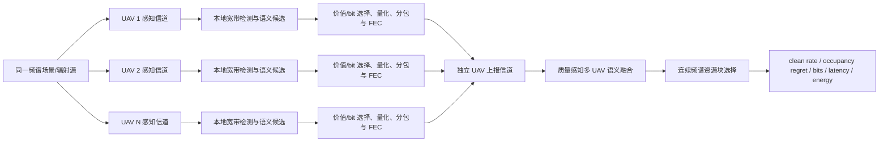

# 硕士论文阶段 0：研究范围、问题定义与统一评价协议

> 状态：论文主线的权威范围文档（canonical scope）  
> 适用对象：后续算法、数据、通信链路、融合、资源选择和论文实验  
> 机器可读版本：`configs/research_scope.json`

## 1. 论文定位

### 1.1 暂定题目

**面向多无人机协同宽带频谱感知的任务导向数字语义通信与资源优化方法研究**

英文题目：

> Task-Oriented Digital Semantic Communication and Resource Optimization for Collaborative Wideband Spectrum Sensing in Multi-UAV Networks

### 1.2 核心问题

宽带频谱观测会产生高数据率 I/Q 或时频数据，而 UAV 的空地上报链路、机载算力和能量均受限。本论文研究：在不要求融合中心重建完整 I/Q 的前提下，UAV 应以何种数字语义形式、使用多少实际传输 bit、通过何种多节点融合方式上报频谱信息，才能可靠支持低干扰频谱资源选择。

### 1.3 总体目标

构建“本地宽带感知—任务语义提取—数字编码与上报—多 UAV 质量感知融合—频谱资源选择”的闭环，在统一 bit、时延和信道条件下，比较原始 I/Q、压缩谱图、硬判决、量化软信息和任务语义方案的任务性能—通信开销折中。

论文的主要优化对象是：

$$
\min \; \mathcal R_{\mathrm{occ}} + \lambda_b B_{\mathrm{tx}} + \lambda_d D_{\mathrm{e2e}} + \lambda_e E_{\mathrm{total}},
$$

其中 $\mathcal R_{\mathrm{occ}}$ 为资源选择占用 regret，$B_{\mathrm{tx}}$ 为实际传输总 bit 数，$D_{\mathrm{e2e}}$ 为端到端时延，$E_{\mathrm{total}}$ 为感知、计算、编码和传输总能耗。阶段 0 固定上述目标定义；后续阶段逐步补齐时延与能耗的实测或可信估计。

## 2. 研究问题与可证伪假设

### RQ1：传什么

当融合中心的目标是选择低占用频谱资源，而不是恢复完整 I/Q 时，哪些时频占用、类别、置信度和不确定性信息最有任务价值？

### RQ2：如何融合

当不同 UAV 的感知质量、空间位置、上报链路可靠性和信息新鲜度不同时，如何在有限总上报预算下融合多节点语义？

### RQ3：何时有效

经过量化、分包、信道编码、误码、丢包和有限重传后，任务语义方案在哪些信道和负载条件下优于传统方案？

据此固定四个可证伪假设：

- **H1（码率效率）**：在达到相同资源选择性能时，任务导向数字语义上报的实际总 bit 数低于硬判决、量化软信息和压缩谱图方案。
- **H2（任务对齐）**：在相同 bit 预算下，直接优化资源选择 regret 的语义编码优于仅优化检测 F1/mAP 的语义编码。
- **H3（协同增益）**：在同一频谱场景的关联多节点观测上，利用感知质量、位置、置信度、上报可靠性和信息新鲜度的融合方法优于简单投票、平均和固定权重融合。
- **H4（数字链路有效性）**：在各方案使用公平分包、FEC、重传和时延预算时，所提方法的任务性能—通信开销优势在数字上报链路中仍然成立。

H1—H4 均允许被实验否定。若某项假设不成立，论文必须报告失效条件，而不是通过改变测试集、预算或评价函数隐藏负结果。

## 3. 系统边界与数据流

必须分开建模：

1. **感知信道**：辐射源到 UAV，影响本地 I/Q、谱图与检测可靠性；
2. **上报信道**：UAV 到融合中心，影响数字语义包能否及时、可靠到达；
3. **下游任务**：融合中心根据收到的信息选择占用最低的连续资源块。

多 UAV 主实验必须使用同一场景的关联观测。随机抽取互不相关的 RadDet 帧进行叠加只能称为“压力仿真”，不能用于证明空间协同增益 H3。

## 4. 预期核心贡献

### C1：资源选择感知的频谱语义表示与联合损失

将频谱 detector 从只优化框级 F1/mAP，扩展为联合优化检测、资源选择 regret、实际码率和置信度校准，使语义表示直接服务于低干扰资源选择。

### C2：任务价值/bit 驱动的变长数字语义编码

根据目标对资源选择的影响、不确定性、信息新鲜度和数字码长，在预算约束下选择占用摘要、目标框、软概率或局部证据，并显式计入量化、协议头、CRC、FEC、填充和重传开销。

### C3：感知质量与上报可靠性联合感知的多 UAV 融合

利用节点感知 SNR、位置、模型置信度、上报链路可靠性和语义年龄进行质量加权融合，并研究有限总预算下的节点/语义联合选择。

其中 C1、C2 为必须完成的核心创新，C3 为主要增强创新。数字链路和半实物平台属于验证贡献，不替代算法创新。

## 5. 明确不作为论文主线的内容

- 不以完整 I/Q 波形重建 MSE 为主要目标；
- 不研究新的图像检测网络、图像语义编码器或图像 JSCC；
- 不把 VisDrone 与 RadDet 的非配对组合称为真实多模态联合感知；
- 不把当前视觉传输策略或单步 DQN/contextual bandit 作为核心创新；
- 不在主论文中同时展开 UAV 轨迹、AirComp、联邦学习、生成模型和对抗安全；
- 不把合成 RadDet 描述为真实 UAV 实测频谱；
- 不把理想标签与原始 I/Q 的码长比直接表述为方法性能提升；
- 不使用不公平的“语义包有保护、原始数据裸传”链路比较；
- 不使用跨原始帧、序列或场景泄漏的训练/测试划分。

现有图像语义代码保留为系统扩展，最多用于展示频谱资源状态如何控制其他任务载荷的传输粒度，不承担 H1—H4 的主要证明责任。

## 6. 统一符号表

| 符号 | 定义 | 单位/范围 |
|---|---|---|
| $N$ | 协同 UAV 数量 | 正整数 |
| $K$ | 候选频谱子信道数 | 正整数 |
| $d$ | 业务需要的连续子信道数 | $1\le d\le K$ |
| $\mathbf x_n$ | 第 $n$ 个 UAV 的本地 I/Q 或时频观测 | 复数序列/实数张量 |
| $h_n^{\mathrm{sense}}$ | 辐射源到第 $n$ 个 UAV 的感知信道 | 信道状态 |
| $h_n^{\mathrm{report}}$ | 第 $n$ 个 UAV 到融合中心的上报信道 | 信道状态 |
| $z_{n,i}$ | 节点 $n$ 的第 $i$ 个语义候选 | box/class/confidence/uncertainty |
| $v_{n,i}$ | 语义候选对下游任务的价值 | 归一化分数 |
| $r_{n,i}$ | 语义候选的实际数字码长 | bit |
| $B_{\max}$ | 单节点或系统总上报预算 | bit/decision-step |
| $B_{\mathrm{tx}}$ | 含协议与保护开销的实际发送总 bit | bit/decision-step |
| $O_k$ | 第 $k$ 个资源块的真实占用率 | $[0,1]$ |
| $\hat O_k$ | 融合中心估计的资源块占用率 | $[0,1]$ |
| $a^*$ | 基于真实占用率的最优资源动作 | 离散索引 |
| $\hat a$ | 基于接收信息选择的资源动作 | 离散索引 |
| $\mathcal R_{\mathrm{occ}}$ | $O_{\hat a}-O_{a^*}$，资源选择占用 regret | $[0,1]$ |
| $D_{\mathrm{e2e}}$ | 感知、推理、编码、排队、传输和融合总时延 | s |
| $E_{\mathrm{total}}$ | 感知、计算、编码、传输及重传总能耗 | J |
| $A_n$ | 第 $n$ 个节点语义信息年龄 | s/decision-step |

## 7. 统一指标与主次关系

### 7.1 主指标

所有主结论必须同时报告以下两类指标：

1. **下游任务性能**：平均 occupancy regret、clean resource rate、missed-occupancy rate；
2. **真实通信成本**：总发送 bit/decision-step、有效 goodput、端到端时延。

其中：

$$
\mathrm{CleanRate}=\frac{1}{T}\sum_{t=1}^{T}\mathbb 1[O_{t,\hat a_t}\le \tau_{\mathrm{clean}}],
$$

$$
\overline{\mathcal R}_{\mathrm{occ}}
=\frac{1}{T}\sum_{t=1}^{T}
\left(O_{t,\hat a_t}-\min_a O_{t,a}\right).
$$

总发送 bit 必须按下式审计：

$$
B_{\mathrm{tx}}=B_{\mathrm{payload}}+B_{\mathrm{header}}+B_{\mathrm{CRC}}+B_{\mathrm{FEC}}+B_{\mathrm{padding}}+B_{\mathrm{retransmission}}.
$$

### 7.2 次指标

- 感知：Precision、Recall、Macro-F1、mAP50、mAP50-95、时频边界误差；
- 校准：ECE、Brier score、可靠性图；
- 链路：BLER、重传次数、失败率、占用时频资源；
- 计算：参数量、MACs/FLOPs、峰值内存、推理时延；
- 能效：J/frame、J/successful-decision、task utility/J；
- 鲁棒性：不同感知 SNR、上报 SNR、节点数、场景密度和域偏移下的退化曲线。

检测 F1/mAP 只能说明前端质量，不能单独证明任务导向通信有效；理想标签压缩倍数只能作为容量上界，不能作为主要方法结果。

## 8. 假设—实验映射与证据门槛

| 假设 | 必须比较的方法 | 固定公平条件 | 主要证据 |
|---|---|---|---|
| H1 | hard、quantized-soft、compressed-spectrogram、proposed semantic | 相同任务性能或相同 bit 预算 | bit—regret/clean-rate Pareto 曲线 |
| H2 | detection-only、confidence top-k、value/bit、resource-aware loss | 相同 detector、数据、预算和链路 | regret、clean rate、消融与置信区间 |
| H3 | 单节点、投票、平均、固定权重、质量感知融合 | 同一关联场景、相同总预算 | 节点数/异质性/失效 sweep |
| H4 | 各源表示经过相同数字链路规则 | 相同 FEC、时延、重传或时频资源 | BLER—任务性能及失效边界 |

每个正式实验必须在结果元数据中记录：

- `hypothesis_ids`：H1—H4 中至少一个；
- `split_id` 与数据 manifest 校验值；
- 配置文件和代码版本；
- 随机种子；
- 基线名称；
- 公平预算类型及数值；
- 感知信道与上报信道配置；
- 主指标与次指标；
- 重复次数、均值、标准差和 95% 置信区间。

不能映射到 H1—H4 的实验可以保留为开发、诊断或扩展实验，但不得作为主论文贡献证据。

## 9. 阶段 0 完成条件

- [x] 论文题目、核心问题和总体目标已固定；
- [x] RQ1—RQ3 与 H1—H4 已定义；
- [x] C1—C3 的主次关系已定义；
- [x] 非研究内容及图像模块边界已固定；
- [x] 感知信道、上报信道与下游任务已分离；
- [x] 统一符号和指标已定义；
- [x] 假设—实验映射规则已建立；
- [x] 机器可读范围配置及自动测试已建立。

后续阶段若需要修改本文件中的题目、H1—H4、C1—C3 或主指标，应记录修改原因，并同步更新 `configs/research_scope.json` 和论文实验协议，避免在看到测试结果后无记录地改变研究问题。
